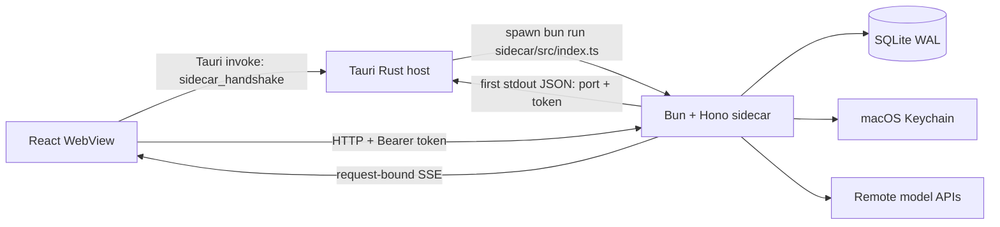
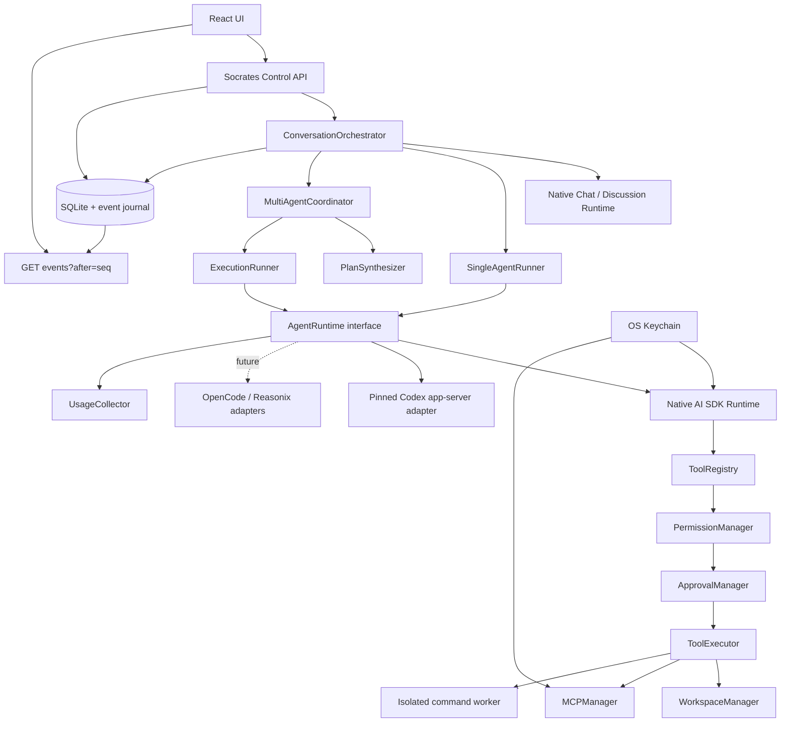
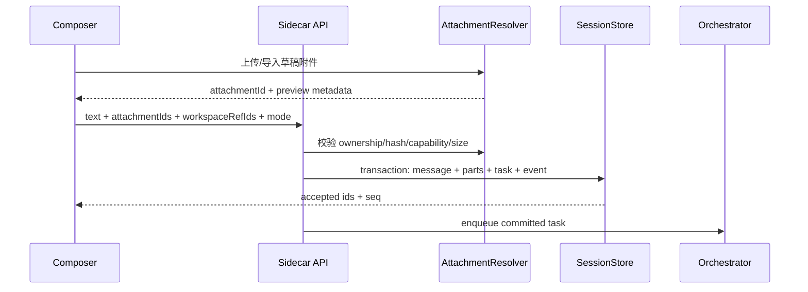
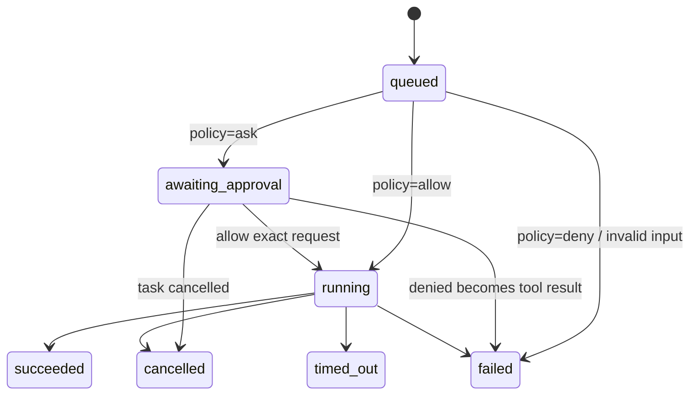
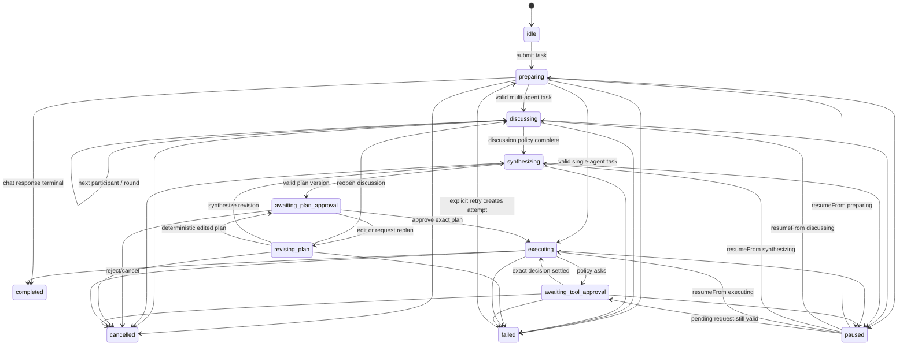
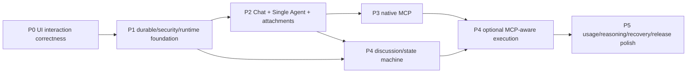

# Socrates Agent Workspace 总体实施计划

> 状态：规划完成稿，尚未进入实现。本文只描述当前 workspace 的真实代码、目标架构、实施顺序与验收门槛。
>
> 本地基线：`codex/58-generated-pixel-theme` 的 `9f7955d5704918e9e8375b4b89c31a7d44a31a2f`；其文件树已由 `main` 的合并提交 `48d982c628f8d00b0ad1cd8c5f835f8ee91db27e` 纳入，二者无内容差异。
>
> 外部研究快照（2026-07-15）：OpenCode `05c3e40a4e641732b991499000ca479e5dad4b02`；Reasonix `main-v2` `95c023b626afb740a19f78f821be166a2d0f984e`；OpenAI Codex `3307ea8b6355ba15546647b02597876341c0489e`。所有外部结论均来自官方仓库的固定提交。

## 执行摘要

Socrates 当前是一个稳定的“多模型文本讨论 MVP”，不是本地 Coding Agent Runtime。最安全、可维护的升级方式不是把 OpenCode、Reasonix 或 Codex 整体复制进仓库，而是保持 Socrates 的现有领域边界，并新增一个可插拔的 `AgentRuntime` 层：

- Socrates 永远拥有 Room、模式、Workspace 同意、Agent 编排、计划版本、审批、审计、usage 归一化和 UI 可重放事件。
- 现有 Vercel AI SDK `ModelGateway` 继续承载普通 Chat、多 Agent 讨论和总结；这些阶段默认无副作用。
- `Single Agent` 与批准后的执行通过统一 `AgentRuntime` 运行。原生 TypeScript Runtime 先覆盖跨 Provider 的聊天、上下文和只读工具；首个写入/命令能力后端推荐固定版本的 `codex app-server --stdio`，避免第一版自行重造成熟的 Agent Loop、sandbox 与双向审批协议。
- OpenCode 的 server/SDK 和 Reasonix 的 ACP 仅作为以后可选的 Runtime adapter；本期不同时引入三个外部守护进程。
- Renderer 不获得文件系统、Shell、MCP 子进程、Provider key 或外部 Runtime 凭证。所有副作用仍在 sidecar/受限执行进程后方。
- 任何计划批准只批准一个带 hash 的计划版本；具体高风险命令、越界访问、网络和 destructive 操作仍需单独审批。
- 任何可能已经开始的非幂等工具调用，在崩溃后都不得自动重放。

建议先合并 P0 的三个 UI 修复，再建立 P1 的事件、迁移、Workspace、权限和 Runtime 契约。没有这些基础，不应直接接入 Shell 或 MCP。

## 1. 当前项目架构和技术栈

### 1.1 运行时与构建

| 层 | 当前实现 | 真实入口/配置 |
| --- | --- | --- |
| 桌面壳 | Tauri 2，Rust | `apps/desktop/src-tauri/src/lib.rs`、`apps/desktop/src-tauri/tauri.conf.json` |
| 前端 | React 19、Zustand 5、Tailwind CSS 4、Vite 7 | `apps/desktop/src/main.tsx`、`App.tsx`、`store.ts` |
| 本机服务 | Bun 1.3、Hono、`bun:sqlite` | `apps/sidecar/src/index.ts` |
| 模型层 | Vercel AI SDK 7、Anthropic 与 OpenAI-compatible adapters | `apps/sidecar/src/gateway-aisdk.ts` |
| 纯领域层 | TypeScript 5.8，零 IO/零 UI | `packages/core/src/*.ts` |
| 包管理/工作区 | Bun workspaces | 根 `package.json`、`bun.lock` |
| 数据 | SQLite WAL + TOML + macOS Keychain | `db.ts`、`config-store.ts`、`secrets.ts` |

当前包结构：

```text
packages/core        纯类型、配置、SSE、Provider、确定性编排
apps/sidecar         Hono API、SQLite、Keychain、代理、模型调用、任务运行
apps/desktop         React UI、Zustand、Tauri Rust host
docs                 既有产品/ADR；其中一部分是未来意图，不等于已实现
```

### 1.2 进程和通信边界



- Rust 只暴露 `sidecar_handshake`。前端拿到随机 loopback 端口和 token 后，直接调用 `http://127.0.0.1:<port>`。
- sidecar 绑定 `127.0.0.1`、随机端口，以随机 bearer token 鉴权；当前 CORS 为 `*`，安全性完全依赖 token。
- 流式回复绑定在发起 POST 的 SSE Response 上。断开不会终止后端模型工作，但前端没有按 sequence 重连和重放能力。
- Rust 只在应用 `RunEvent::Exit` 时 kill sidecar；尚无子进程监督、崩溃重启、后台任务恢复或 release sidecar bundling。
- Tauri 权限目前只有 `core:default` 与 `opener:default`，没有 dialog/fs/shell/process plugin 权限；这是良好的最小起点。

### 1.3 当前状态与数据模型

- Zustand 的 `apps/desktop/src/store.ts` 同时承担 API client、SSE reducer、页面状态与业务动作。
- `packages/core/src/chat.ts` 的 `ChatMessage` 和 `StoredMessage` 都是单一 `content: string`；没有内容块、附件、工具调用、reasoning 或审批。
- `packages/core/src/orchestration.ts` 仅有 `round_robin | debate`，按确定性 turn plan 顺序调用文本 `ModelGateway`。
- SQLite 现有表：`providers`、`agents`、`rooms`、`room_agents`、`messages`、`tasks`、`turns`。
- `tasks` 的持久状态只有 `running/completed/failed/cancelled`。AbortController 和失败处置 resolver 是 `apps/sidecar/src/rooms.ts` 内存 `Map`，sidecar 重启会留下无 owner 的 `running` 行。
- `config.toml` 存语言、明暗主题、关闭行为、音效、代理和外观。API key 使用 Keychain；但代理 username/password 当前仍会明文进入 TOML，需在安全基础阶段迁移为 secret ref。
- `closeBehavior` 目前只有配置/UI；Rust 没有拦截窗口 close 来实现后台驻留，因此它不是已完成能力。

### 1.4 当前验证命令

| 检查 | 命令 | 本次结果 |
| --- | --- | --- |
| Lint | `bun run lint` | 无法运行：退出码 1，完整错误为 `error: Script not found "lint"`；这是当前仓库原有的 script 缺口，P1 `ENG-001` 增加后作为强制 gate |
| 单元/集成测试 | `bun test` | 87 pass，0 fail，16 files |
| 核心/sidecar 类型检查 | `bun run typecheck` | 通过 |
| Desktop 类型检查与构建 | `bun run --cwd apps/desktop build` | 通过；304 modules transformed |
| Sidecar smoke | 隔离 `SOCRATES_DATA_DIR` 启动后请求 `/health`、`/config` | 通过；sandbox 内监听受限，获准在隔离环境外启动后成功 |

## 2. 已存在能力与缺失能力

| 能力 | 当前状态 | 证据/限制 |
| --- | --- | --- |
| Provider 与 Keychain key | 已有 | `providers.ts`、`secrets.ts`；只支持 `openai_compatible | anthropic` |
| 模型列表 | 部分 | `/providers/:id/models`；失败被前端静默降级为手输，Provider 默认模型仍是 input |
| Agent/Room/头像/昵称 | 已有 | 支持唯一昵称、图片 data URL、房间成员追加 |
| Chat | 已有但文本-only | 房间第一个 Agent 回复；无工具、附件、usage 持久化 |
| 多 Agent | 已有 MVP | Round Robin/Debate、顺序、轮数、总结、retry/skip/abort |
| Markdown/IME/自动增高 | 已有 | `react-markdown`、IME grace、最高 160px；无用户拖拽高度 |
| Workspace | 缺失 | 无 folder picker、canonical path、session binding、recent list |
| 文件上下文/附件/图片 | 缺失 | avatar 上传不等于聊天附件；消息仍为 string |
| `@path` | 缺失 | 无目录搜索、suggestion、结构化 workspace ref |
| Agent Loop | 缺失 | 当前 `streamText` 无工具定义和 follow-up loop |
| Tool Registry/Tool Result | 缺失 | 没有工具 schema、状态、输出限制或 audit |
| 文件写入/Shell | 缺失 | Tauri capability 也未开放；不得从 Renderer 直接新增 |
| 权限/审批/沙箱 | 仅文档 | `docs/05-security-permissions.md` 是意图，生产代码无实现 |
| MCP | 缺失 | 设置页 Skills/Memory 只是占位，没有 MCP SDK/生命周期 |
| Usage | 部分 | 编排 turns 仅 input/output；单聊丢弃 `done.usage` |
| Reasoning effort/capability | 缺失 | 无 per-model capability、effort mapping、raw usage |
| 可恢复事件流 | 缺失 | SSE 无 event sequence；UI 断开只能丢实时过程 |
| 正式 DB migrations | 缺失 | `CREATE IF NOT EXISTS` + `ALTER TABLE` 辅助函数 |
| Release sidecar | 缺失 | Rust 注释明确当前 dev-only 通过 Bun 启动 TS |

结论：现有多模型讨论逻辑应保留并包进新的模式/状态机，不应为了 Coding Agent 能力重写整个产品。

## 3. 三个 UI Bug 的代码路径、根因和验证办法

完整复现矩阵见 `doc/ui-interaction-bug-audit.md`。这里记录架构层结论。

### 3.1 Pixel 1998 图标模糊、边缘异常、设置图标太小

代码路径：

- `apps/desktop/src/PixelIcon.tsx`
- `apps/desktop/src/index.css:15-41`
- `apps/desktop/public/icons/pixel-1998-sprite-clean.png`
- `apps/desktop/src/App.tsx`（top tab size 15）
- `apps/desktop/src/Settings.tsx`（nav size 16）

已确认根因不是字体继承：

1. Pixel 1998 的 9 个图标来自一张 1254×1254 RGBA 生成图，单格 418×418，再缩到 15–28 CSS px，是约 15–28 倍的极端降采样。
2. 源图本身含渐变、半透明阴影和紫红色 halo，不是低分辨率、硬边像素资源；`image-rendering: pixelated` 无法把这些边缘变成干净 pixel art。
3. `.pixel-icon__generated` 再施加 `transform: scale(1.16)`。在 15/16px、Retina DPR 和非 100% zoom 下会产生非整数 device-pixel 映射。
4. 设置导航固定 16px、顶栏 15px，却显示细节丰富的大图标；可辨识尺寸不足。
5. 代码绘制的 10×10 SVG rect fallback 使用 `shapeRendering: crispEdges`，没有被全局 `image-rendering` 污染，反而是当前较清晰的路径。

修复原则：统一 `PixelIcon` API，但分离 micro icon 与 decorative art。Pixel 1998 的导航图标重新制作成 8×8/10×10/16×16 的硬边微图标（多色 SVG rect 或精确 1x/2x PNG），禁止运行时 `scale()`；生成大图只允许在 ≥32px 装饰位使用。设置导航最小 20px、top tab 18–20px，hit target 不小于 36×36px。

验证：1x/2x DPR、100/125/150% WebView zoom、light/dark、15–32px visual snapshot；同时检查 computed rect、无 transform、无半透明 halo，并在 1x 外接显示器与 2x Retina 真机截图对比。

### 3.2 Hover 音效在按钮内部重复

代码路径：`apps/desktop/src/App.tsx:34-52`、`apps/desktop/src/fx.ts`。

已确认根因：document 上使用会冒泡的 `pointerover`，每次事件都对 `event.target.closest("button")` 调用 `sfx.hover()`。指针从 button 本体跨到图标、文字或嵌套 span 时会产生新的 `pointerover`；新 target 仍能找到同一 button。React effect 有 cleanup 且依赖为空，AudioContext 也被复用，因此不是重复注册或重复创建音频实例。

修复：保留单一事件委托，但比较 `target.closest(selector)` 与 `relatedTarget.closest(selector)`，只有进入新的 enabled interactive root 才播放。不要用 debounce 掩盖事件模型。提取纯函数并测试“外部→A、A child→A child、A→B、离开→重入、disabled、rerender”。

### 3.3 粒子只在局部按钮、位置不是真实点击点

代码路径：`apps/desktop/src/fx.ts:55-94`、`ChatPage.tsx`、`ProvidersPage.tsx`、`AgentsSection.tsx`。

已确认根因：`pixelBurst(el)` 只接受 Element，并取 `getBoundingClientRect()` 中心；全局 `App` 监听器只有 button click 音效。关闭、删除、归档等 handler 各自显式调用 `pixelBurst`，所以空白区、聊天区和普通设置项无效果，且改成全局后若不删局部调用会双重爆发。

修复：增加一个只挂载一次的 `GlobalFxLayer`，在 capture-phase `click` 上处理 `event.detail > 0` 的 pointer/tap 合成点击，以 `clientX/clientY` 调 `pixelBurstAt`。键盘激活的坐标无意义，默认不出粒子但保留可访问性；disabled/拖拽不会产生 click。删除所有组件内 burst 调用。粒子使用 `pointer-events:none`、固定坐标、并发节点上限/对象回收，并尊重 `prefers-reduced-motion`。

## 4. 参考项目中可借鉴的具体模块和设计

### 4.1 OpenCode

官方快照：[`anomalyco/opencode@05c3e40`](https://github.com/anomalyco/opencode/tree/05c3e40a4e641732b991499000ca479e5dad4b02)，默认开发分支 `dev`。

| 官方路径 | 借鉴点 | 不直接复制的原因 |
| --- | --- | --- |
| [`packages/web/src/content/docs/server.mdx`](https://github.com/anomalyco/opencode/blob/05c3e40a4e641732b991499000ca479e5dad4b02/packages/web/src/content/docs/server.mdx) | `opencode serve` 是官方 HTTP/OpenAPI/SSE seam | 会引入第二套 Provider、Session、DB 和 credentials |
| `packages/opencode/src/tool/tool.ts`、`tool/registry.ts` | definition → materialize → authorize → execute → settle；大输出托管 | 内部 packages 是 private，依赖图和 V1/V2 正迁移 |
| `packages/core/src/permission.ts` | action/resource/effect 的资源权限 | 默认 last-match 语义不足以表达 Socrates 的 hard deny |
| `packages/core/src/filesystem.ts`、`location-mutation.ts` | lexical + realpath/symlink 边界检查 | 仍需按 Socrates workspace/secret policy 重写 |
| `packages/core/src/tool/bash.ts` | 源码明确区分 policy 与真实 OS sandbox | OpenCode shell 当前拥有 host 用户权限，不可当成硬隔离 |

采用其协议分层、工具状态和 event replay 思想；不导入 private packages。`opencode serve + @opencode-ai/sdk/v2` 仅保留为以后可选、固定版本的 Runtime pilot。

OpenCode 的 `plan`/`build` 值得借鉴的是“Agent capability profile + permission rules + 显式切换”，不应照搬其具体强度：固定快照里的 Plan 主要依赖选中 Agent、prompt reminder 与规则，`plan_exit` 再产生一条切到 build 的 synthetic user message；它没有不可变 plan version/hash，也不能构成 Socrates 的 durable approval boundary。因此 Socrates 保留只读 planning 与 write-capable execution 的能力分离，但把状态、plan hash 和批准做成一等持久事实。

### 4.2 Reasonix 1.x（只研究 main-v2 Go 线）

官方快照：[`esengine/DeepSeek-Reasonix@95c023b`](https://github.com/esengine/DeepSeek-Reasonix/tree/95c023b626afb740a19f78f821be166a2d0f984e)。README 明确 1.x 是 Go 重写，legacy TypeScript 在 `v1` 维护分支，不作为本计划架构来源。

| 官方路径 | 借鉴点 | Socrates 处理 |
| --- | --- | --- |
| `desktop/frontend/src/components/Composer.tsx` | display text 与 submitted context 分离；附件/@ref/resize 完整状态机 | 抽取最小 state machine，不移植约 3800 行组件 |
| `internal/control/attachments.go` | 10/25MB、magic-byte MIME、拒 symlink、read 前后 stat、受控目录 | 在 sidecar 原生实现，附件不写入用户仓库 |
| `desktop/frontend/src/lib/atMatches.ts`、`FileReferenceMenu.tsx` | 尾部 @ token、一层目录、短期 cache、去重 | 路径建议只作 UX；send 时 sidecar 再授权 |
| `internal/provider/provider.go`、`internal/config/config.go` | usage、pricing、reasoning、vision、per-model capability | 保留 Socrates Keychain，不采用 Reasonix `.env` credential store |
| `internal/permission/permission.go`、`internal/control/approval.go` | 纯 policy 与阻塞 Gate 分离；pending prompt 可重放 | 加 durable approval record 和 exact-input hash |
| `internal/acp/*` | 现行 Go Runtime 的官方 NDJSON JSON-RPC adapter | 可选；ACP 当前丢 Usage/Phase 且不支持图片输入 |

Reasonix 当前 head 比最初研究父提交多了“移除 Windows native sandbox”的合并；它不影响 composer/ACP 结论，但进一步说明不能把跨平台 sandbox 当作静态事实。

Reasonix 的双模型是一个逻辑 Agent 内部的串行 planner→executor：两者有独立 session，planner 只读，usage 按 source 区分；它不同于 Socrates 中可见的任意多参与者讨论。若未来接 Reasonix，该 planner/executor pair 只算一个 Socrates `AgentRuntime`，不能暗中把每个房间 turn 变成双倍调用。Reasonix 的 MCP Host、`mcp__server__tool` 命名、后台连接/teardown可借鉴；其 plugin package 还包含 skills/hooks/install/update 与供应链问题，明确延后到 MCP、权限和审计稳定之后。

### 4.3 OpenAI Codex

官方快照：[`openai/codex@3307ea8`](https://github.com/openai/codex/tree/3307ea8b6355ba15546647b02597876341c0489e)。

| 官方路径 | 借鉴/复用点 | 限制 |
| --- | --- | --- |
| [`codex-rs/app-server/README.md`](https://github.com/openai/codex/blob/3307ea8b6355ba15546647b02597876341c0489e/codex-rs/app-server/README.md) | 官方 rich-client 边界；stdio JSONL、双向 request、thread/turn/item | WebSocket 标记实验；必须固定 binary/schema |
| `codex-rs/core/src/session/*` | 完整 model→tool→result→follow-up Agent Loop | 不直接嵌 Rust crates |
| `codex-rs/core/src/tools/orchestrator.rs` | approval reviewer、sandbox selection、retry/denial | 不把 Codex 内部状态当 Socrates 产品状态 |
| `codex-rs/app-server-protocol/src/protocol/v2/*` | command/file/MCP item、approval RPC、usage/model list | native Plan fields仍是 experimental |
| `codex-rs/protocol/src/protocol.rs` | read-only/workspace-write/external sandbox policy | legacy workspace-write 是写边界，不是全盘读取边界 |
| TUI plan implementation | Plan 完成后由 client 展示 Implement/Revise；执行是新 Default turn | 计划批准不是一个工具 approval RPC |

推荐把固定版本 `codex app-server --stdio` 作为第一种成熟的 write/shell `AgentRuntime`，但 Socrates 仍记录自身 plan、approval 和 presentation journal。不开启 `danger-full-access`、auto-review 或 unsandboxed `thread/shellCommand`。

## 5. 复用、Adapter 和自行实现方案比较

| 方案 | 上手速度 | 当前栈兼容 | Provider 广度 | 安全/恢复 | 维护成本 | 决策 |
| --- | --- | --- | --- | --- | --- | --- |
| OpenCode one-shot CLI | 快 | 一般 | 广 | 审批事件有损，恢复差 | 中 | 只作开发 smoke |
| OpenCode server + SDK | 中 | 好（HTTP/TS） | 广 | shell 不是硬 sandbox；V1/V2 漂移 | 高 | 可选 pilot，不进首发关键路径 |
| Reasonix one-shot CLI | 快 | 一般 | 以 OpenAI-compatible/DeepSeek 为主 | 非交互审批不适合 UI | 中 | 只作 batch 可选项 |
| Reasonix ACP | 中 | 好（stdio JSON-RPC） | 依赖 Reasonix 配置 | 无 authoritative usage/phase/image | 中高 | 可选 Runtime，非首发 |
| Codex exec/TS SDK | 快 | 一般 | Codex 支持范围 | 缺双向 rich approval | 中 | spike only |
| Codex app-server | 中 | 好（stdio + generated TS） | 受 Codex Provider 支持约束 | 成熟 loop/sandbox/approval；presentation resume 仍有损 | 中高 | 首个 write/shell Runtime |
| Socrates 原生最小 Runtime | 较慢 | 最佳 | 最佳 | 可完全对齐产品；Shell sandbox 最难 | 中 | Chat、讨论、上下文、只读工具的战略实现 |
| Fork/嵌入任一完整项目 | 看似快 | 差 | 不确定 | 双数据库/凭证/生命周期冲突 | 极高 | 拒绝 |

最终选择是混合而非双重实现：

1. 领域协议、Workspace、附件、权限判定、计划状态机、事件 journal、MCP 配置、usage schema 在 Socrates 原生实现。
2. `NativeAgentRuntime` 使用现有 AI SDK 7（已含 ToolSet、tool approval、reasoning/usage part）完成跨 Provider 的 Chat/讨论/只读工具。
3. `CodexAgentRuntime` 通过 app-server 提供第一版受 sandbox/approval 约束的完整 Single Agent 和 Execution。
4. 只有当 Native command worker 的 OS 隔离达到 DoD 后，才把任意 Provider 的 native Runtime 升级为 write/shell executor。

## 6. 推荐目标架构



关键 ownership：

- `ModelGateway` 仍是“无工具的一次模型流”接口；不要把 Codex rich events 压扁进它。
- 新增 `AgentRuntime` 处理 session、turn、tool/approval/item/recovery；所有 adapter 映射到 Socrates-owned event envelope。
- sidecar 是唯一业务 authority。外部 Runtime 的 session ID 只是 mapping，不是 Room/Task 的主键。
- SQLite 先提交事件/状态，再 SSE broadcast。UI 断线不改变任务事实。
- 一个 canonical workspace 同时最多一个 write-capable lease；多个只读讨论可并行，但首版默认串行以控制 Provider rate limit 和上下文一致性。
- Runtime capability 决定 Agent 是否可被选为 execution agent；UI 必须禁止选择只有 chat/read 能力的 Agent。

## 7. 进程边界和 IPC/RPC

### 7.1 进程职责

| 进程 | 可以做 | 不可以做 |
| --- | --- | --- |
| React WebView | 展示、编辑草稿、选择模式、发控制请求、消费 event journal | 读取任意路径、持有 key、spawn、直接调用 MCP/Runtime |
| Tauri Rust | 顶层 sidecar 生命周期、原生 folder/file consent dialog、最终 release path；未来监督 command worker | 运行产品编排、保存 Provider key 到 UI、把 shell plugin 暴露给 Renderer |
| Bun sidecar | DB、Keychain、模型、Workspace validation、MCP、orchestration、adapter supervision、audit | 在主进程直接执行未经隔离的任意 Shell |
| Codex app-server child | 其 thread 的 Agent Loop、工具、sandbox、MCP（若该 Runtime 启用） | 决定 Socrates room 状态、绕过 plan gate、直接对 Renderer 开端口 |
| Native command worker（后续） | 按 capability token 执行一条已批准命令、流输出、kill process tree | 访问 Provider key/sidecar token、改审批、发任意网络 |

### 7.2 Tauri 边界

保留 `sidecar_handshake`，新增最少 native commands/plugin：

```rust
#[tauri::command]
async fn pick_workspace() -> Result<Option<String>, String>;

#[tauri::command]
async fn pick_files(options: PickFilesOptions) -> Result<Vec<String>, String>;
```

建议使用 `tauri-plugin-dialog`，只授予 main window 的 folder/file picker 权限。返回路径代表用户选择，不代表已授权；sidecar 仍须 `realpath`、检查目录存在并创建 Workspace record。Tauri v2 已有 `getCurrentWebview().onDragDropEvent`，OS drop 的 path 同样发给 sidecar 验证。

### 7.3 Sidecar Control API

控制请求与事件订阅分离，POST 不再持有整个任务生命周期：

| Endpoint | 用途 |
| --- | --- |
| `POST /sessions` | 创建 Chat/Single/Multi 会话并绑定 mode/workspace |
| `POST /sessions/:id/messages` | 提交结构化 composer submission，返回 message/task id |
| `POST /sessions/:id/tasks` | 启动 Single/Multi task，立即返回 accepted state |
| `GET /sessions/:id/events?after=<seq>` | 先 replay 再 live follow 的 SSE |
| `POST /tasks/:id/cancel` | 幂等取消 |
| `POST /tasks/:id/pause`、`/resume` | 可恢复控制 |
| `POST /tasks/:id/plan-decisions` | approve/edit-and-approve/replan/reject，携带 plan version/hash |
| `POST /approvals/:id/decision` | 对 exact tool request 作幂等决定 |
| `PUT /sessions/:id/workspace` | 绑定 canonical workspace |
| `GET /workspaces/:id/entries|search` | 有界 `@path` 数据 |
| `POST /attachments` | multipart bytes 或经 native consent 的 path import |
| `GET /attachments/:id/content` | 鉴权预览/下载 |
| `GET/POST/PUT/DELETE /mcp/servers` | MCP 配置与状态控制 |

事件 envelope：

```ts
export interface SessionEvent<TType extends string = string, TPayload = unknown> {
  schemaVersion: 1;
  eventId: string;
  seq: number;               // session 内严格递增
  sessionId: string;
  taskId?: string;
  turnId?: string;
  itemId?: string;
  type: TType;
  occurredAt: string;
  payload: TPayload;
}
```

SSE 发送 `id: <seq>` 与 JSON data。客户端保存每个 session 的 `lastAppliedSeq`，按 eventId/seq 去重。未知事件保留为 opaque diagnostic，不让 exhaustive switch 崩溃。

### 7.4 外部 Runtime 与 command worker

- Codex：sidecar `Bun.spawn([codexPath, "app-server", "--stdio"])`；stdout 只作 NDJSON，stderr 单独 redacted log。先 `initialize` 再 `initialized`。协议 TS/JSON Schema 从固定 binary 生成并进入版本目录。
- OpenCode（未来）：只允许 loopback `opencode serve` + Basic auth + matching SDK，never expose server URL/auth to UI。
- Reasonix（未来）：一个 persistent `reasonix acp` child，stdout 只 NDJSON；ACP usage/image capability 明确显示 unavailable。
- Native worker（后续）：length-prefixed JSON/NDJSON；request 包含 call id、exact argv/shell、canonical cwd、writable roots、network policy、timeout、redacted env allowlist；response 为 started/stdout/stderr/exited/failed。

## 8. 核心模块和 Interface

### 8.1 模块职责表

| 模块 | 职责、输入输出 | 依赖与生命周期 | 错误处理 | 文件建议 |
| --- | --- | --- | --- | --- |
| `ProviderAdapter` | Provider/model request、模型列表、content part 与 usage 归一化 | 每 Provider 配置实例；依赖 SecretStore/fetch | 分类 auth/rate/network/capability；不泄露 key | `packages/core/src/provider-adapter.ts`、`apps/sidecar/src/providers/*` |
| `ModelCapabilities` | 模态、tool、effort、context、usage 字段、runtime 能力 | catalog + 用户 override，按 provider/model cache | 未知能力 fail closed；UI 显示 unavailable | `packages/core/src/model-capabilities.ts` |
| `AgentProfile` | nickname、role、provider/model/runtime、policy、default effort | 长期记录；替代当前只含 prompt 的 Agent 视图 | 删除/变更时 snapshot 到 session/turn | 扩展 `chat.ts`，后续拆 `agent.ts` |
| `AgentSession` | 一个 Agent 在一个 conversation 的独立 backend session/history/usage | session 生命周期；依赖 Runtime/Store | backend 丢失标 interrupted，不伪造恢复 | `packages/core/src/agent-session.ts`、DB `agent_sessions` |
| `ConversationOrchestrator` | 根据 `chat/single_agent/multi_agent` 路由 runner | task 生命周期；依赖 state machine | 非法 mode/capability 在 preparing 前拒绝 | `packages/core/src/conversation.ts`、sidecar service |
| `SingleAgentRunner` | 驱动一个 Runtime turn、处理 items/approvals/cancel | 每 task 一实例；依赖 AgentRuntime/EventStore | crash 后 reconcile，绝不重发未知 side effect | `apps/sidecar/src/runtime/single-agent-runner.ts` |
| `MultiAgentCoordinator` | participant/order/round/effort、讨论、synthesis、handoff | 每 Multi task；依赖 ModelGateway/StateMachine | 单 Agent failure 按 retry/skip/fallback policy | `packages/core/src/multi-agent.ts` + sidecar host |
| `PlanSynthesizer` | 从讨论和只读 workspace evidence 产出 versioned structured plan | synthesis turn；依赖 chosen Agent/JSON schema | schema repair 有上限；失败进入 failed/replan | `packages/core/src/plan.ts`、sidecar service |
| `ExecutionRunner` | 校验 approved plan、锁 workspace、驱动 designated Runtime | approval 后创建；依赖 Runtime/leases | scope expansion 回到 approval；未知调用暂停 | `apps/sidecar/src/runtime/execution-runner.ts` |
| `ToolRegistry` | 注册/过滤/物化 builtin 与 MCP tool definitions | sidecar 启动 + workspace/MCP generation | 重名、stale schema、invalid input fail closed | `packages/core/src/tools.ts`、sidecar registry |
| `ToolExecutor` | queued→approval→running→terminal；截断/托管输出 | 每 call；依赖 Permission/Approval/Workspace | timeout/cancel/worker crash 显式 terminal | `apps/sidecar/src/tools/tool-executor.ts` |
| `PermissionManager` | 纯 policy evaluation；agent∩room∩global | 无状态 core；rules/version 输入 | hard deny 优先，未知 side effect 默认 ask/deny | `packages/core/src/permissions.ts` |
| `ApprovalManager` | 持久 pending、幂等 decision、grant、replay | sidecar singleton；依赖 DB/EventStore | orphan pending→interrupted；hash mismatch 重新请求 | `apps/sidecar/src/approvals.ts` |
| `WorkspaceManager` | select/recent/bind、canonical path、containment、lease | sidecar singleton；每 session binding | traversal/symlink/TOCTOU/outside 均拒绝或 ask | `apps/sidecar/src/workspaces.ts` |
| `AttachmentResolver` | draft upload/import、preview、workspace ref、provider payload | draft→linked→GC；依赖 Workspace/Provider capability | MIME/size/hash/read race/capability 明确错误 | `apps/sidecar/src/attachments.ts` |
| `MCPManager` | config、transport、discover、call、restart/backoff | global/workspace host；依赖 SDK/SecretStore | failed/needs_auth/degraded；child teardown | `apps/sidecar/src/mcp/*` |
| `UsageCollector` | 归一化 raw usage、price snapshot、聚合、emit | 每 provider call；依赖 capability/pricing | unknown 存 null，不写 0；raw redacted | `packages/core/src/usage.ts`、sidecar collector |
| `SessionStore` | migrations、records、append event + projection transaction | sidecar singleton | busy/constraint/transient IO 分类；事务回滚 | `apps/sidecar/src/store/*` |
| `TaskStateMachine` | 唯一合法状态转换、attempt/idempotency keys | pure core reducer | illegal transition 抛 typed domain error | `packages/core/src/task-state.ts` |

### 8.2 关键 TypeScript 契约

```ts
export type RunMode = "chat" | "single_agent" | "multi_agent";
export type RuntimeKind = "native" | "codex" | "opencode" | "reasonix";

export interface AgentRuntime {
  readonly kind: RuntimeKind;
  capabilities(profile: AgentProfile): Promise<RuntimeCapabilities>;
  openSession(input: OpenAgentSession): Promise<RuntimeSessionRef>;
  startTurn(input: RuntimeTurnInput): AsyncIterable<RuntimeEvent>;
  answerRequest(requestId: string, decision: RuntimeDecision): Promise<void>;
  interrupt(turnId: string): Promise<void>;
  resume(ref: RuntimeSessionRef): Promise<RuntimeResumeSnapshot>;
  close(ref: RuntimeSessionRef): Promise<void>;
}

export interface RuntimeCapabilities {
  chat: boolean;
  readTools: boolean;
  writeTools: boolean;
  shell: boolean;
  networkPolicy: boolean;
  mcp: boolean;
  imageInput: boolean;
  replay: "none" | "history" | "live_and_history";
  approval: "none" | "host" | "native";
}

export interface ToolDefinition<I = unknown, O = unknown> {
  name: string;
  description: string;
  inputSchema: JsonSchema;
  risk: ToolRisk;
  idempotency: "read" | "idempotent" | "non_idempotent";
  execute(input: I, context: ToolContext): Promise<O>;
}

export type ToolCallStatus =
  | "queued"
  | "awaiting_approval"
  | "running"
  | "succeeded"
  | "failed"
  | "cancelled"
  | "timed_out";

export interface ToolContext {
  callId: string;
  sessionId: string;
  taskId: string;
  turnId: string;
  agentId: string;
  workspace: WorkspaceCapability;
  signal: AbortSignal;
}

export interface PermissionEvaluation {
  effect: "allow" | "ask" | "deny";
  risk: ToolRisk;
  matchedRuleIds: string[];
  reasonCode: string;
  freshHumanRequired: boolean;
  policyVersion: number;
}
```

`ProviderAdapter` 的消息输入必须是 content parts，而不是本地路径字符串：

```ts
export type MessagePart =
  | { type: "text"; text: string }
  | { type: "image"; attachmentId: string; mediaType: string; alt?: string }
  | { type: "file"; attachmentId: string; mediaType: string; filename: string }
  | { type: "workspace_ref"; refId: string; relativePath: string; snapshotHash?: string }
  | { type: "tool_call"; callId: string; name: string; input: unknown }
  | { type: "tool_result"; callId: string; output: ToolOutputRef; isError: boolean }
  | { type: "reasoning_summary"; text: string };
```

### 8.3 第一版本地工具清单与 Runtime ownership

所有工具无论由 Native executor 还是 Codex app-server 实际执行，都投影到同一 `ToolCall`/`ToolResult`/approval/event schema；Provider adapter 不能直接调用文件系统。首发实现分工如下：

| 统一能力 | 标准工具/事件 | 第一实现 owner | 首发约束 |
| --- | --- | --- | --- |
| workspace 信息 | `workspace_info` | Native builtin | canonical root identity、只读、输出有界 |
| 列目录 | `list_directory` | Native builtin | relative path、depth/count/ignore/secret policy |
| 搜索文件 | `search_files` | Native builtin | glob/query、time/result cap |
| 搜索文本 | `search_text` | Native builtin | file/byte/match cap；binary跳过 |
| 读文件 | `read_file` | Native builtin | range/byte cap、MIME/secret/symlink检查 |
| 创建文件 | normalized `file_change` | Codex Runtime first；Native worker以后 | workspace-write、exact path/patch、approval/policy |
| 修改文件 | normalized `file_change` | Codex Runtime first | before/evidence hash、diff可审计 |
| 应用 patch | normalized `file_change/apply_patch` | Codex Runtime first | patch input/hash、冲突显式失败 |
| 删除/移动 | normalized `file_change` | Codex Runtime first | destructive/fresh-human规则，跨root拒绝 |
| 执行命令 | normalized `command_execution` | Codex Runtime first | canonical cwd、sandbox、argv/action、网络策略 |
| 命令流/结果 | `command_output` + terminal `ToolResult` | Codex adapter映射 | stdout/stderr有界，exit code/duration/status |
| 取消长命令 | `interrupt`/`cancel_tool_call` | Runtime adapter/supervisor | grace后kill process tree，未知结果不伪装cancelled |

Codex-owned tool不进入 Native `execute()` 函数，但 adapter 必须先创建统一 queued call，映射其 command/file approval，随后持久化 running/succeeded/failed/cancelled/timed_out。Native write/shell只有在独立 command worker达到安全DoD后才能替换/扩展这个owner，不影响上层协议。

## 9. 数据结构与持久化方案

### 9.1 迁移原则

当前 `CREATE IF NOT EXISTS` 加零散 `ALTER TABLE` 不能继续承载 Agent Workspace。P1 先引入只向前执行、事务化、可测试的 migration runner：

1. `schema_migrations(version, name, checksum, applied_at)` 记录严格递增版本；启动时先校验已应用 migration checksum，发现漂移直接拒绝写入。
2. 首次跨大版本迁移前，关闭当前写连接并用 SQLite online backup API 或一致性副本生成带时间戳备份；不得只复制活跃 WAL 下的主文件。
3. 每个 migration 在 `BEGIN IMMEDIATE` 内执行，升级 projection 与索引后再提交；失败完整回滚。
4. 新旧消息结构先双读：旧 `messages.content` 映射为一个 text part，新写同时填 summary/text compatibility column；验证后再停止双写。不得在同一版本删除旧列。
5. 大表 backfill 分批、可重复，进度写入 migration metadata；启动路径不执行无上限 backfill。
6. downgrade 不做破坏性 SQL 回滚；失败恢复依赖升级前备份与二进制版本兼容窗口。

### 9.2 推荐表与关键约束

| 表/变更 | 关键字段 | 关键约束与索引 |
| --- | --- | --- |
| `schema_migrations` | `version`、`name`、`checksum`、`applied_at` | `version` PK；checksum 不可变 |
| `workspaces` | `id`、`canonical_path`、`display_path`、`identity_hash`、`created_at`、`last_opened_at` | canonical identity 唯一；路径不进入普通消息 |
| `recent_workspaces` | `workspace_id`、`label`、`bookmark_ref?`、`pinned`、`last_used_at` | 最近列表与安全授权材料分离 |
| `sessions` 或扩展 `rooms` | `id`、`mode`、`workspace_id?`、`title`、`status`、`created_at` | `mode ∈ chat/single_agent/multi_agent`；active task FK |
| `session_agents` | `session_id`、`agent_id`、`snapshot_json`、`position`、`execution_eligible` | nickname/role/model/policy 做不可变 snapshot |
| `agent_sessions` | `id`、`session_id`、`agent_id`、`runtime_kind`、`runtime_session_ref`、`status`、`last_event_cursor` | `(session_id,agent_id)` 可多 attempt；外部 ref 加密/最小化 |
| `messages` 扩展 | `author_kind`、`author_id?`、`status`、`reply_to_id?`、`created_at` | 保留 compatibility text；不保存 data URL/blob |
| `message_parts` | `id`、`message_id`、`ordinal`、`type`、`text?`、`attachment_id?`、`tool_call_id?`、`metadata_json?` | `(message_id,ordinal)` 唯一；type CHECK |
| `attachments` | `id`、`sha256`、`media_type`、`filename`、`byte_size`、`storage_key`、`status`、`created_at` | bytes 在 app data；hash/size 索引；无任意绝对路径 |
| `message_attachments` | `message_id`、`attachment_id`、`ordinal` | 引用计数/GC 可追踪 |
| `workspace_refs` | `id`、`workspace_id`、`relative_path`、`kind`、`snapshot_hash?`、`snapshot_size?` | relative path 规范化；send 时重新验证 |
| `tasks` 扩展 | `mode`、`state`、`attempt_no`、`resume_from_state?`、`owner_lease_id?`、`terminal_reason?` | 只通过 state reducer 更新 |
| `task_attempts` | `id`、`task_id`、`attempt_no`、`started_at`、`ended_at?`、`checkpoint_json?` | `(task_id,attempt_no)` 唯一；retry 新建 attempt |
| `task_events` | `event_id`、`session_id`、`task_id?`、`seq`、`type`、`payload_json`、`occurred_at` | `(session_id,seq)` 与 `event_id` 都唯一；append-only |
| `plan_versions` | `id`、`task_id`、`version`、`content_json`、`content_hash`、`created_by`、`status` | `(task_id,version)` 唯一；批准记录绑定 hash |
| `tool_calls` | `id`、`task_id`、`attempt_id`、`turn_id`、`agent_id`、`name`、`input_json`、`input_hash`、`risk`、`idempotency`、`status` | 稳定 idempotency key 唯一；状态有限集 |
| `tool_outputs` | `tool_call_id`、`preview_text`、`storage_key?`、`sha256?`、`byte_size`、`truncated`、`is_error` | 大输出写受控文件；DB 只保留有界 preview |
| `approval_requests` | `id`、`task_id`、`kind`、`subject_id`、`input_hash`、`policy_version`、`status`、`expires_at?` | 同一 pending subject/hash 唯一 |
| `approval_decisions` | `id`、`request_id`、`decision`、`scope`、`decided_at`、`reason?` | append-only；幂等 decision key |
| `permission_rules` | `id`、`scope_kind`、`scope_id?`、`action`、`resource_pattern`、`effect`、`priority`、`version` | hard deny 独立标记；scope/version 索引 |
| `permission_grants` | `id`、`request_id`、`workspace_id`、`subject_hash`、`scope`、`expires_at` | 不允许给 fresh-human 操作持久授权 |
| `usage_records` | `id`、`session_id`、`task_id?`、`turn_id?`、`agent_id?`、token 字段、`cost?`、`currency?`、`pricing_snapshot_json?`、`raw_redacted_json?` | 未知是 NULL，不写 0；多维索引 |
| `mcp_servers` | `id`、`scope`、`transport`、`config_json`、`secret_refs_json`、`enabled` | config 不含明文 secret；名称在 scope 内唯一 |
| `mcp_tool_policies` | `server_id`、`tool_name`、`effect`、`risk_override?` | `(server_id,tool_name)` 唯一 |
| `runtime_sessions` | `id`、`runtime_kind`、`external_id?`、`protocol_version`、`binary_version?`、`status` | adapter 恢复映射；不作为产品主状态 |
| `workspace_leases` | `id`、`workspace_id`、`task_id`、`mode`、`owner_instance_id`、`expires_at` | canonical workspace 同时一个 write lease |
| `audit_events` | `id`、`actor`、`action`、`resource`、`decision`、`metadata_redacted_json`、`created_at` | append-only；不保存 key、完整 env 或敏感输出 |

文件型 payload 存在 `${appData}/attachments/<sha-prefix>/<sha>`、`${appData}/tool-outputs/...` 等受控目录，SQLite 仅保存 hash、大小和 storage key。删除消息只减少引用；后台 GC 在 retention window 后删除无引用文件，并记录 audit event。

### 9.3 幂等性与事件一致性

- Multi-Agent 模型 turn 使用稳定 key：`<taskId>:<attemptNo>:<phase>:<round>:<participantIndex>`。已存在 terminal turn 时只重放记录，不再次调用模型。
- Tool call 使用 Runtime item ID；没有稳定外部 ID 时，由 `attempt + turn + ordinal + inputHash` 派生。相同 key、不同 input hash 是 protocol violation。
- `append event + update projection` 必须在同一 SQLite transaction。SSE 只能广播已提交 event。
- UI reducer 只接受 `seq === lastSeq + 1`；发现 gap 立即从 `after=lastSeq` replay，不推测中间状态。
- 模型流 delta 可以聚合为有界 checkpoint event，最终 content/usage 单独提交；不能把每个 token 永久写一行导致数据库失控。
- approval、cancel、pause 与 plan decision 都带 client idempotency key；重复请求返回原 decision/result。

## 10. Agent、Tool、Message、Attachment、Usage 与 Approval 数据流

### 10.1 Composer 到持久消息



UI 的 display draft 与 submitted payload 分离；`@foo.ts` 在视觉上仍是文本 token，但提交时变成 `workspace_ref` part。提交失败不清空草稿。刷新后只恢复非敏感 draft metadata，不把本地文件 bytes 放入 localStorage。

### 10.2 Model/Agent turn

1. `ConversationOrchestrator` 读取 session/agent/workspace snapshot，并做 capability preflight。
2. `ContextAssembler` 只从允许的 message parts、attachment snapshots、workspace refs 和受控 compaction 生成 provider input。
3. Native Runtime 调 `ProviderAdapter`；Codex Runtime 则把批准的 cwd、attachments/prompt 映射到 app-server turn。
4. 所有 Runtime event 先标准化、持久化，再映射为 message/tool/approval timeline。
5. turn terminal 时 `UsageCollector` 保存 current usage 与累积 projection；缺字段保留 NULL。
6. context compaction 是一条显式记录的 system operation，包含 covered range、summary hash 和生成模型；不能静默替换历史。

### 10.3 Tool 生命周期



`ToolRegistry` 先按 mode、Agent、Room、Workspace 和 MCP generation 过滤工具，再把 schema 暴露给模型。模型返回 call 后重新校验 JSON schema 和 policy；不能相信模型看到的旧 schema。deny 应返回结构化 tool result，让 Agent 可解释/换方案，但 destructive hard deny 不允许通过重写 prompt 绕过。

### 10.4 Attachment 与图片

- picker/drop/paste/path-import 最终都进入同一 `AttachmentResolver`，先写临时文件，流式计算 SHA-256 和 size，再 magic-byte 检测 MIME，最后原子 rename。
- 建议首发限制：单图 10 MiB、其他单文件 25 MiB、每次最多 10 个文件且总量 50 MiB；文本进入模型上下文前还有独立字符/token 上限。
- 默认支持 PNG/JPEG/WebP/GIF（首版可仅静态首帧预览）和 UTF-8 文本类文件；SVG/HTML 预览不得以内联 active content 运行。
- API 通过鉴权 endpoint 返回 bytes；Renderer 创建短生命周期 Blob URL 并在 unmount/replacement 时 revoke。
- 必须区分四件事：本地路径引用、作为文本上下文、Provider file upload、原生 multimodal image。UI 不可用一个“已附加”状态掩盖能力差异。
- Multi-Agent 在开始前检查所有参与者的 image/file capability。不能让部分 Agent 看图片、部分 Agent 静默看不到而仍宣称共享上下文；应阻止不兼容参与者或要求用户明确排除。
- Provider upload ID 与过期时间单独映射到 attachment hash；过期重传不能改变原消息内容。

### 10.5 Usage 与 reasoning

统一字段：`inputTokens`、`outputTokens`、`totalTokens`、`cachedInputTokens`、`cacheWriteTokens`、`reasoningTokens`、`cost`、`currency`、`source`、`current`、`cumulative`、`effort`、`status`。未知字段用 `null`；estimated cost 必须带 model/pricing/version snapshot 和 `estimated=true`。

模型 catalog 声明 `reasoningEfforts: [auto|minimal|low|medium|high|xhigh|max]` 及 provider mapping；这些是归一化上限而非每个 Provider 都支持的固定枚举。UI 只显示该模型实际支持的子集；用户选了已不支持的 effort 时，preparing 阶段失败并要求重选，不能静默降级。reasoning 原文只有 Provider 明确返回且 policy 允许时保存；默认仅展示 reasoning summary。

### 10.6 Approval

每个审批 request 包含 `kind`、可读摘要、exact structured input、`inputHash`、workspace identity、policy version、风险、可能影响和有效期。decision 可为 `allow_once`、`allow_session`、`deny`；只有低/中风险且规则允许时才出现持久 grant。plan approval 另有 `approve_exact_plan`、`edit_and_approve`、`request_replan`、`reject`，绝不能转换成宽泛 tool grant。

## 11. Multi-Agent 精确状态机

### 11.1 状态定义

```ts
type TaskState =
  | "idle"
  | "preparing"
  | "discussing"
  | "synthesizing"
  | "awaiting_plan_approval"
  | "revising_plan"
  | "executing"
  | "awaiting_tool_approval"
  | "paused"
  | "failed"
  | "cancelled"
  | "completed";
```

| 状态 | 持久事实 | 允许副作用 |
| --- | --- | --- |
| `idle` | session 尚无 active task | 无 |
| `preparing` | task/attempt 已建；校验 workspace、agent、capability、budget | 只读 metadata；不得调用模型/工具前就标 running |
| `discussing` | 当前 round/participant/turn key | 模型调用；默认无写入与有副作用命令，可按明确策略开放受信只读工具 |
| `synthesizing` | chosen synthesizer 与 discussion cutoff 固定 | 模型调用与只读 evidence；产出结构化 plan |
| `awaiting_plan_approval` | exact plan version/hash pending | 无执行副作用 |
| `revising_plan` | revision instruction、父版本、范围固定 | 回到讨论/总结的模型调用；仍不得写 workspace |
| `executing` | approved plan hash、designated executor、write lease | 经 policy/approval 的 Runtime 工具 |
| `awaiting_tool_approval` | exact tool request pending；保存 `resumeFrom=executing` | 无该工具副作用；其他并发写首版也暂停 |
| `paused` | 原状态、checkpoint、pause reason | 无新副作用；正在执行的 child 先 interrupt/settle |
| `failed` | attempt terminal error、last safe checkpoint、side-effect certainty | 无；retry 必须新建 attempt |
| `cancelled` | terminal reason 和已发 interrupt | 只做受控 cleanup/audit |
| `completed` | terminal result、usage、final seq | 无 |

### 11.2 合法转换



补充约束：

- `cancelled`、`completed` 是绝对 terminal；同一个 attempt 不复活。`failed -> preparing` 实际是同一 task 下创建新 attempt，并记录 `retry_of`。
- `awaiting_plan_approval -> cancelled` 的 plan reject 必须使用 `terminal_reason=plan_rejected`，与用户全局 cancel 区分。
- tool deny 是一个 terminal tool result，通常回到 `executing` 让 Agent 处理；只有 Runtime 无法继续时才进入 `failed`。
- `paused` 必须保存 `resumeFromState` 和 checkpoint；不允许“resume”时根据 UI 猜状态。
- Chat 可复用 event/session 基础，但不应伪装成完整 Multi state machine；其一次响应在 `preparing -> completed/failed/cancelled` 的轻量 runner 内完成。

### 11.3 故障、重试和 fallback

- sidecar instance 持有可续期 ownership lease。启动时扫描非 terminal task；lease 已过期则写 `runtime_interrupted` event，将状态转为 `paused` 或 `failed`，不得直接继续。
- 只在确认模型请求尚未被 Provider 接收，或 Provider 明确返回可安全 retry 的 rate limit/transport error 时指数退避；已经产生 delta/usage 的请求默认不自动重发。
- tool 状态为 `running` 且 worker/runtime 断开时标记 `outcome_unknown`。只读幂等工具可由用户确认后重试；非幂等工具必须人工核查。
- Agent fallback 只能来自 task 创建时的显式顺序/策略，并产生 `agent_fallback_selected` event。不能在背后用不同模型补一个“看似同一 Agent”的回答。
- context window 超限触发可见 compaction checkpoint；compaction 失败不丢原始消息。

## 12. Workspace 与路径安全

### 12.1 选择、绑定和切换

1. Renderer 通过原生 folder picker 获取用户明确选择；返回路径只是一份 consent evidence。
2. sidecar 对路径做绝对化、`realpath`、目录/可读性检查，生成 canonical identity；UI 保存 display path，不自行拼接授权。
3. session 绑定 `workspace_id`，task 创建时 snapshot 该 binding。已有 active task 时禁止原地切换；用户可取消后切换，或用目标 workspace 新建 session。
4. Recent workspace 只保存 identity/label/last-used。若 macOS sandboxed distribution 需要跨重启 security-scoped bookmark，则由 Rust 安全保存 bookmark ref，sidecar 只拿本次已恢复授权的路径。
5. 同一个 canonical workspace 同时只允许一个 write lease；read-only discussion 可以共享，但首版默认 task 级串行。

### 12.2 路径解析算法

所有 file tool 输入是 workspace-relative POSIX-style path，不接收 UI 传来的 arbitrary absolute path：

```text
normalize lexical relative path
  -> reject empty/NUL/absolute/drive-prefix/.. escape
  -> join canonical workspace root
  -> resolve existing target with realpath
  -> require target inside canonical root
  -> for create: realpath nearest existing parent, require inside root
  -> lstat target/parent and reject disallowed symlink
  -> immediately before read/write/open, repeat containment and identity check
  -> operate through capability-scoped handle/worker
```

- read：open 后用 `fstat` 校验类型/size，并在必要时对比 pre/post stat，防止替换竞态。
- create/write：对真实父目录校验；临时文件必须在同目录，以 `O_EXCL` 创建并原子 rename。不得沿用户可变 symlink 写入。
- delete/rename：必须列出 exact targets；目录递归、覆盖、跨根移动属于 fresh-human destructive request。
- outside read：默认 `ask`，一次授权绑定 exact canonical target/hash 和 session，过期即失效；outside write 默认 hard deny。
- macOS 文件别名、Unicode normalization、大小写不敏感 volume、hard link 与 symlink 都需专门测试；只做字符串 `startsWith(root)` 不合格。

### 12.3 Secret 与忽略规则

在 workspace 内也设置 global hard deny/read-redaction：`.env*`、`*.pem`、SSH、cloud credentials、Keychain 导出、浏览器 profile、`node_modules` secret caches、`.git/objects` 等。允许用户查看“为什么被拒绝”，但 UI/audit 不显示 secret 内容。目录搜索遵循 `.gitignore`、Socrates ignore 和大小/深度上限；ignore 不等于安全 boundary，tool execute 仍必须走 policy。

外部文档、仓库文件和 MCP 结果都标为 untrusted context。Prompt injection 不能改变 PermissionManager；模型文本中的“用户已批准”永远不是 approval evidence。

## 13. MCP 生命周期与边界

### 13.1 配置模型

Socrates 保存 canonical MCP 配置，分 `global` 与 `workspace` scope：

```ts
type MCPTransportConfig =
  | { transport: "stdio"; command: string; args: string[]; cwd?: string; envRefs: Record<string, SecretRef> }
  | { transport: "streamable_http"; url: string; headerRefs: Record<string, SecretRef> };

type MCPConnectionState =
  | "disabled"
  | "disconnected"
  | "connecting"
  | "connected"
  | "needs_auth"
  | "degraded"
  | "failed"
  | "stopping";
```

- TOML/SQLite 只存非敏感 config 与 Keychain secret refs；Renderer 从不读回 secret 值。
- 首发支持 stdio 与 Streamable HTTP；旧 SSE transport 只在出现明确兼容需求时增加。
- server name 在 scope 内唯一，工具名标准化为 `mcp__<server>__<tool>`，禁止覆盖 built-in tool。
- import/export 默认 redacted；导出 secret 只能走单独、明确、不可持久授权的敏感流程，本计划不建议首发实现。

### 13.2 Manager 生命周期

1. 读取 enabled 配置并解析 Keychain refs。
2. 校验 command/URL、workspace scope 与 policy；stdio executable 不能从未经批准的 workspace 路径隐式执行。
3. 建立 transport，执行 initialize/capability negotiation。
4. 拉取 tools/resources/prompts；保存 schema hash、server generation 和只读 runtime snapshot。
5. ToolRegistry 只暴露当前 connected generation 且 policy 允许的工具。
6. 断开后立刻撤下工具；在途 call 标明 connection lost，而不是落到同名新 generation。
7. 非鉴权崩溃按 1/2/5/10/30 秒加 jitter 重连；稳定运行一段时间后重置 backoff。`needs_auth` 不自动风暴式重试。
8. disable、workspace close、应用退出时先停止接收 call，等待有界 grace period，再 terminate/kill child 并写 audit。

每个 tool schema 都可配置 `allow/ask/deny` 与 risk override，但 server 自报 annotation 仅是提示，不能降低本地 policy 的风险级别。Resources/prompts 也是 untrusted content，读取本地 URI 前仍过 Workspace policy。

### 13.3 与 Runtime 的 ownership

- `NativeAgentRuntime` 使用 Socrates `MCPManager`，因此 MCP event、approval、usage 和 recovery 都进入统一 journal。
- Codex app-server 自身可以管理 MCP。首个 Codex milestone 默认不自动同步 Socrates MCP，避免一个 server 被双重连接与出现两套 approval。后续若启用，sidecar 为每个 Codex thread 生成隔离、redacted、固定版本 config，并在 UI 明示“由 Codex Runtime 托管”。
- 同一 task 对同一 MCP server 只有一个 host owner。adapter 断开时不能静默 fallback 到 Native host。
- “Agent 技能/插件市场”不属于 MCP P3。MCP 首发只做明确配置的 servers、tools、resources 和权限；不执行任意下载脚本。

## 14. 文件、图片、`@path` 与 Composer 流程

### 14.1 Draft 状态机

```text
empty -> editing -> resolving_refs/uploading -> ready -> submitting
                                      |             |
                                      v             v
                                    error       submit_failed
                                                     |
                                                     v
                                                   ready
```

草稿包含 `displayText`、selection、resolved tokens、pending attachment items、mode options 和 composer height。`submittedText`/content parts 只在用户发送时冻结；上传中不能发送，失败项可删除或重试。输入法 composition 期间 Enter 只交给 IME，composition end 后必须等待下一次独立 keydown 才发送。

### 14.2 `@path` 建议

- 只解析 caret 前的尾部 token，不扫描整篇文本；支持空格路径时使用明确 quoting/selection token，而不是猜测。
- sidecar 只返回 workspace-relative name、kind、parent 和可选小图标；默认一层目录，搜索有数量/深度/时间预算。
- 建议 cache 5 秒，并用 `workspace generation + query + directory` 作 key；文件变化或 workspace 切换使 generation 失效。
- 选择项生成 opaque `workspaceRefId`。send 时 sidecar 再做 path containment、size、MIME、secret 和 snapshot hash 检查；suggestion 结果不是授权。
- 删除/编辑视觉 token 会同步删除 ref；纯文本粘贴 `@foo` 不自动获得文件能力。

### 14.3 Provider 映射

| 输入类型 | Native text-only | Native vision/file | Codex Runtime | 不兼容处理 |
| --- | --- | --- | --- | --- |
| 文本 | 直接 content part | 直接 content part | turn input text | 正常 |
| workspace text ref | 有界读取后带 source boundary | 同左 | approved cwd/path item 或有界文本 | secret/too large 报错 |
| 图片 | OCR/描述必须用户明确选择，默认不伪造 | 原生 image part 或 Provider upload | 仅协议 capability 为真时映射 | preparing 阻止 |
| 二进制文件 | 不直接注入 | Provider file API 支持才上传 | adapter capability 为真才映射 | 显示“该模型不支持” |
| tool output file | 有界 preview + storage ref | 同左，可选 image | Runtime item + Socrates mirror | 不把绝对路径暴露 UI |

ContextAssembler 为每个 source 加不可伪造的结构化 provenance metadata；渲染时显示文件名、snapshot 状态和是否已经变化。执行前若 approved plan 依赖的 workspace ref hash 变化，必须回到 replan/approval，而不是照旧执行。

### 14.4 可调整 Composer

- 默认高度 104px；拖动上边缘在 `104px..min(360px, 40vh)` 内调整。
- pointer move 只写 pending height，在 `requestAnimationFrame` 应用，避免现在字体 slider 那类全窗口连续重排；pointer capture 保证拖出边界仍可结束。
- 键盘 focus 在 resize handle 时，方向键每次 8px，Shift 每次 24px；双击恢复默认。
- 只把 layout height 存 localStorage：先按 opaque `workspaceId` 取值，未绑定 workspace 时回落到用户级默认；绝不使用绝对路径作 key。消息、附件路径和未提交敏感文本不持久化在这里。
- `prefers-reduced-motion` 下去掉弹性高度动画；屏幕阅读器有 `separator`/`aria-valuenow`。

## 15. 权限、审批与整体安全模型

### 15.1 判定顺序

PermissionManager 是纯函数，效果按以下顺序取最严格交集，不采用“最后一条规则覆盖一切”：

```text
global hard deny
  > runtime/agent capability ceiling
  > room/mode capability ceiling
  > scoped resource rule
  > exact approval or still-valid grant
  > safe default (read ask, side effect ask/deny)
```

标准 action/resource 类别：

- workspace read / list / search；
- workspace create / modify / delete / rename；
- outside-workspace read / write；
- shell command、process spawn、destructive command；
- network host/method；
- MCP server/tool/resource；
- secret access、credential use；
- provider/model call 与预算。

模式 ceiling：

| 模式/阶段 | 默认工具能力 |
| --- | --- |
| Chat | 无工具；只允许用户显式附加的 content |
| Single Agent | 按 Agent/Room policy 开放 read/write/shell/MCP；所有副作用经 gate |
| Multi `discussing` | 无写入/有副作用命令；可选受信只读 workspace tools |
| Multi `synthesizing` | 只读 evidence；不得借总结触发执行 |
| Multi `executing` | 只有指定 execution Agent 获得 approved plan 范围内能力 |

计划批准与工具批准分离：plan approval 只授权“可以进入 executing 并尝试这份计划”，不是 blanket filesystem/shell 权限。执行时 command、路径或网络范围超出 plan hash 的声明，必须触发新 approval 或 replan。

### 15.2 审批 UX 和防重放

- UI 显示 Agent/runtime、cwd、exact argv/patch/path/host、风险原因、预计影响、policy source 和“允许一次/本会话/拒绝”。不把长 command 截到无法判断；可折叠但 hash 覆盖完整输入。
- 决策绑定 request ID、input hash、workspace identity、task attempt、policy version。任何一个变化都使旧 decision 无效。
- `rm -rf`、递归删除、覆盖未跟踪修改、outside write、secret 导出、关闭 sandbox 等 fresh-human 操作永不提供 session/permanent allow。
- denied request 仍留 durable event；UI 不允许 Runtime 用新的 request ID 对完全相同的 hard-denied input 无限弹窗。
- plan 编辑后生成新 version/hash；旧批准自动失效。实施中 workspace evidence 变化也应暂停并提示。

### 15.3 Process、网络与 secret

- Renderer 不启用 Tauri fs/shell/process plugin；所有路径/命令通过 sidecar authority。
- Codex Runtime 只启用 `read-only` 或 `workspace-write`，绝不暴露 `danger-full-access`、auto-review、unsandboxed `thread/shellCommand`。`workspace-write` 仍只代表写边界；Socrates 还要用自己的 secret/read policy 收窄可读内容。
- Native arbitrary shell 在 OS-isolated command worker 完成前不发布。仅靠 cwd、prompt 或 JS allowlist 不叫 sandbox。
- network 默认关闭或 ask；允许时绑定 hostname/port/method，处理 DNS rebinding、redirect、loopback/link-local/cloud metadata。MCP remote 同样过 egress policy。
- Provider/API/MCP/proxy credentials 全存 Keychain。当前 config.toml 的代理 username/password 要迁移为 secret ref，并从日志、error、event payload、crash report 中 redaction。
- sidecar token 不进持久日志，CORS 从 `*` 收紧到 Tauri origin/明确 allowlist；对 Origin/Host 做校验，并给下载/preview endpoint 同等 Bearer auth。
- `tauri.conf.json` 从 `csp: null` 改为最小 CSP：仅 app self、必要 loopback connect、受控 blob image；禁止任意 remote script/frame。
- release 不依赖用户安装 Bun。sidecar/adapter binary 要签名、固定版本、校验 hash，父子进程监督并在退出时 kill process tree。

### 15.4 Threat-driven 测试

至少覆盖 traversal、symlink swap、hard link、case-folding、Unicode path、TOCTOU、malicious filename/MIME、oversized zip-like file、MCP schema spoof、prompt injection、approval replay、SSE gap/duplicate、Runtime protocol injection、stderr secret、child orphan、DNS rebinding、redirect 越界和 DB crash consistency。任何一个失败都阻止 write/shell/MCP milestone 发布。

## 16. License、来源与归属

| 项目 | 固定快照许可 | 计划中的使用方式 | 归属动作 |
| --- | --- | --- | --- |
| OpenCode | [MIT](https://github.com/anomalyco/opencode/blob/05c3e40a4e641732b991499000ca479e5dad4b02/LICENSE)，Copyright 2025 opencode | 设计参考；未来可选 server/SDK adapter | 若复制实质代码或分发 SDK，保留 MIT license/copyright；记录版本 |
| Reasonix | [MIT](https://github.com/esengine/DeepSeek-Reasonix/blob/95c023b626afb740a19f78f821be166a2d0f984e/LICENSE)，Copyright 2026 Reasonix Contributors | 设计参考；不复制 3800 行 Composer；未来可选 ACP child | copied/adapted 代码逐文件标注并在 third-party notices 保留 MIT |
| OpenAI Codex | [Apache-2.0](https://github.com/openai/codex/blob/3307ea8b6355ba15546647b02597876341c0489e/LICENSE) + [NOTICE](https://github.com/openai/codex/blob/3307ea8b6355ba15546647b02597876341c0489e/NOTICE) | 固定 binary 的 app-server protocol adapter；可能随包分发 binary | 分发时附 LICENSE/NOTICE、OpenAI copyright 与 NOTICE 中 Ratatui attribution；记录源码/构建来源 |

本计划优先“协议调用 + 原创实现”，不复制外部内部模块。即使只通过协议调用，release manifest 也记录 binary/SDK 名称、version/commit、license、下载来源、SHA-256 和是否 bundled。任何生成的 Codex protocol schema 都与生成它的 binary 版本一起归档，并在 generated file header 写明来源。

不得从 OpenCode private workspace packages 或 Reasonix legacy TS v1 直接复制代码；若实现过程中参考某个具体函数达到衍生程度，要在 PR 中登记 source path/commit/license，由发布清单汇总。图标、字体和声音也要进入同一 third-party asset inventory；AI 生成资源需要保留生成来源与可商用审核记录。

## 17. 现有文件逐项修改计划

以下是实施期预期触碰的现有生产文件；每张票只修改与自身边界相关的一小组，不做一次性“大重构”。

### 17.1 Root 与 Core

| 现有文件 | 计划修改 |
| --- | --- |
| `package.json` | 增加 `lint`、migration/smoke/E2E 脚本；保持根命令可从任意 shell 清晰执行 |
| `bun.lock` | 仅由批准的依赖票更新并和 package manifest 同 PR |
| `packages/core/src/index.ts` | 导出新 session、message part、runtime、tool、permission、usage、state-machine 契约 |
| `packages/core/src/chat.ts` | 兼容性地扩展 Agent snapshot、session/mode、structured message；旧 text DTO 保持迁移窗口 |
| `packages/core/src/provider.ts` | ProviderAdapter error taxonomy、model capabilities、reasoning/attachment capability；不保存 secret |
| `packages/core/src/config.ts` | 非敏感 workspace/MCP/UI 配置 schema；代理 credential 改 secret ref |
| `packages/core/src/orchestration.ts` | 保留现有 Round Robin/Debate planner，改为 Multi coordinator 的纯计划组件；不混入 IO/tool execution |
| 对应 `*.test.ts` | 每个新 reducer/policy/migration compatibility case 用 Bun test 覆盖 |

### 17.2 Sidecar

| 现有文件 | 计划修改 |
| --- | --- |
| `apps/sidecar/src/index.ts` | 从单文件 route wiring 演进为 service composition root；注册 event/session/workspace/attachment/MCP API，启动 migration 和 child supervisor |
| `apps/sidecar/src/db.ts` | 拆出连接/transaction/migration；先保留旧 helper facade，逐票迁移 callers |
| `apps/sidecar/src/rooms.ts` | 把 HTTP、SSE、orchestration、内存 resolver 分离；旧 endpoint 作为 compatibility adapter，最终调用新 services |
| `apps/sidecar/src/gateway-aisdk.ts` | structured content、tool-capable Native adapter、provider usage/error mapping；ModelGateway text path继续可测 |
| `apps/sidecar/src/providers.ts` | 模型 catalog/capability endpoint、显式 list-model errors、default cheapest policy只基于可验证 catalog metadata |
| `apps/sidecar/src/agents.ts` | runtime kind、policy、reasoning default、capability validation；nickname snapshot/唯一约束继续保留 |
| `apps/sidecar/src/secrets.ts` | 通用 typed secret refs，用于 Provider/MCP/proxy；统一 redaction 与 delete lifecycle |
| `apps/sidecar/src/config-store.ts` | 迁移 proxy secret、只持久非敏感 TOML；版本化 config migration |
| `apps/sidecar/src/net.ts` | 将 proxy 与将来 egress policy 分离；系统代理仍是 Provider/MCP HTTP 客户端的输入，不当作 sandbox |
| 现有 sidecar tests | 增加 compatibility、auth、event replay、restart、secret-redaction；不删除现有 87-test baseline |

### 17.3 Desktop/Tauri

| 现有文件 | 计划修改 |
| --- | --- |
| `apps/desktop/src-tauri/src/lib.rs` | sidecar supervisor、原生 folder/file picker integration、退出/child cleanup；不把 fs/shell 权限给 WebView |
| `apps/desktop/src-tauri/Cargo.toml`、`Cargo.lock` | 增加 dialog plugin；后续 release sidecar/binary packaging 所需最小 crates |
| `apps/desktop/src-tauri/capabilities/default.json` | 只增加 main window dialog 权限；逐项 deny 未用权限 |
| `apps/desktop/src-tauri/tauri.conf.json` | 最小 CSP、bundled resource/sidecar、签名与更新元数据；不同 release 票分开审查 |
| `apps/desktop/src/store.ts` | 拆成 typed API client + event reducer + feature stores；保留 compatibility selector，避免整 UI 同时改写 |
| `apps/desktop/src/App.tsx` | 模式/全局 shell、单实例 FX event delegation；修 hover 与全局 click particle |
| `apps/desktop/src/ChatPage.tsx` | mode selector、workspace chip、timeline、plan/approval cards、attachments、composer state/resize；删除局部 particle 调用 |
| `apps/desktop/src/Settings.tsx` | Workspace/permissions/MCP/runtime capability/nav；Skills/Memory 占位不伪装为 MCP |
| `apps/desktop/src/ProvidersPage.tsx` | capabilities、reasoning、模型列表错误与 usage/pricing metadata；删除局部 particle 调用 |
| `apps/desktop/src/AgentsSection.tsx` | runtime/policy/effort/editor、execution eligibility；删除局部 particle 调用 |
| `apps/desktop/src/PixelIcon.tsx` | generated decorative art 与 micro icon renderer 分离；稳定 integer size API |
| `apps/desktop/src/fx.ts` | `isInteractiveEntry` 纯函数、`pixelBurstAt`、node budget/reduced-motion；中心点 API 删除 |
| `apps/desktop/src/index.css` | 主题 tokens、micro icon 尺寸、timeline/composer/approval styles；禁用 fractional icon transform |
| `apps/desktop/src/i18n.ts` | 所有新状态、风险、错误、模式、MCP/usage 文案三语完整，不用 raw protocol text |
| `apps/desktop/package.json` | dialog API 与测试/可访问性工具的最小依赖；避免引入完整 UI framework |
| 现有 UI tests | 延续 IME、头像、room selection 测试；增加 event delegation、reducer、composer 与 visual harness |

### 17.4 既有文档

| 现有文件 | 计划修改 |
| --- | --- |
| `docs/02-system-architecture.md` | 用实际 AgentRuntime/event journal/process boundary 更新，不把规划描述为已实现 |
| `docs/03-engineering-design.md` | 加 schema、service lifecycle、protocol version 与 recovery |
| `docs/04-orchestration-protocol.md` | 新状态机、plan hash、agent session、idempotency 与 fallback |
| `docs/05-security-permissions.md` | 以本计划的 precedence、workspace/path、MCP、fresh-human policy 取代笼统 future design |
| `docs/06-mvp-roadmap.md` | 保留历史 MVP，新增 Agent Workspace milestones；不要重写已完成历史 |
| `docs/adr/0001-0003` | 不改历史决定正文；若边界变化，用 superseding ADR 链接而不是覆盖 |

## 18. 新文件与目录计划

### 18.1 Core（纯 TS、零 IO）

```text
packages/core/src/
  conversation.ts             RunMode、session/task input、路由判定
  message-parts.ts             structured content 与 validation
  agent-session.ts             Agent/session snapshots
  model-capabilities.ts        modality/tool/effort/runtime capabilities
  runtime.ts                   AgentRuntime 与 normalized events
  tools.ts                     ToolDefinition/status/risk/output refs
  permissions.ts               pure policy evaluator
  approvals.ts                 request/decision/grant domain types
  usage.ts                     normalized usage/cost types
  task-state.ts                exact state reducer/transition table
  plan.ts                      structured/versioned plan 与 hash input
  workspace.ts                 canonical capability/path request types
  events.ts                    envelope/schema/reducer contracts
  mcp.ts                       config/state/tool snapshot types
```

每个非平凡文件有同名 `*.test.ts`。`packages/core` 不 import Bun、Tauri、SQLite、AI SDK、MCP SDK 或 Node fs。

### 18.2 Sidecar（按 deep module 拆分）

```text
apps/sidecar/src/
  store/
    connection.ts
    migrations.ts
    migrations/001_*.ts ...
    event-store.ts
    session-store.ts
    attachment-store.ts
  services/
    conversation-orchestrator.ts
    multi-agent-coordinator.ts
    plan-synthesizer.ts
    context-assembler.ts
    usage-collector.ts
  runtime/
    runtime-manager.ts
    native-agent-runtime.ts
    single-agent-runner.ts
    execution-runner.ts
    child-supervisor.ts
    codex/
      adapter.ts
      protocol-client.ts
      protocol/<binary-version>/*.ts
      mapper.ts
  tools/
    registry.ts
    executor.ts
    builtin/read-file.ts
    builtin/list-directory.ts
    builtin/search-files.ts
  workspace/
    manager.ts
    path-policy.ts
    leases.ts
  attachments/
    resolver.ts
    mime.ts
    gc.ts
  approvals/
    manager.ts
  mcp/
    manager.ts
    connection.ts
    transport-stdio.ts
    transport-http.ts
  routes/
    sessions.ts
    events.ts
    workspaces.ts
    attachments.ts
    approvals.ts
    mcp.ts
  security/
    redaction.ts
    egress-policy.ts
    audit.ts
```

目录可以随任务逐步出现，不允许先创建空壳。外部 Runtime adapter 必须有 transcript fixture tests，不依赖每次 CI 真正访问模型。

### 18.3 Desktop

```text
apps/desktop/src/
  api/client.ts
  events/sessionEventReducer.ts
  stores/sessionStore.ts
  stores/settingsStore.ts
  composer/Composer.tsx
  composer/composerMachine.ts
  composer/AttachmentTray.tsx
  composer/PathReferenceMenu.tsx
  composer/ResizeHandle.tsx
  workspace/WorkspacePicker.tsx
  workspace/WorkspaceChip.tsx
  timeline/Timeline.tsx
  timeline/ToolCallCard.tsx
  timeline/ApprovalCard.tsx
  timeline/PlanCard.tsx
  timeline/UsageSummary.tsx
  settings/McpSettings.tsx
  settings/PermissionSettings.tsx
  settings/RuntimeSettings.tsx
  fx/GlobalFxLayer.tsx
  fx/interactiveEntry.ts
  icons/micro/*.tsx
```

在 Tauri 侧增加 `dialog.rs`、`sidecar.rs`（以及真正进入 release 票时的 `runtime_binary.rs`）。不要在 WebView 创建任何 `shell.ts`/`filesystem.ts` 直接能力模块。

### 18.4 Docs、fixtures 与 release metadata

```text
docs/adr/0004-agent-runtime-boundary.md
docs/adr/0005-workspace-capability-and-approvals.md
docs/adr/0006-event-journal-and-recovery.md
docs/adr/0007-codex-app-server-adapter.md
docs/protocols/session-events-v1.md
docs/security/agent-workspace-threat-model.md
tests/fixtures/codex-app-server/<version>/*.jsonl
tests/fixtures/mcp/*.json
THIRD_PARTY_NOTICES.md
third_party/runtime-manifest.json
```

## 19. 依赖变更计划

### 19.1 必要依赖

| 依赖 | 放置 | 原因 | 约束 |
| --- | --- | --- | --- |
| `@tauri-apps/plugin-dialog` | Desktop JS | folder/file picker | 版本与 Tauri 2 lockstep；只暴露 picker |
| `tauri-plugin-dialog` | Rust | 原生 consent dialog | capability 最小化 |
| `@modelcontextprotocol/sdk` | Sidecar | stdio/Streamable HTTP、schema/protocol | 固定 minor，adapter 封装，不让 SDK types 穿透 core |
| `ajv`（如 MCP SDK 不足） | Sidecar | 动态 MCP/tool JSON Schema validation | 开 strict mode、限制复杂度；先 spike 再决定 |
| `ignore`（可选但倾向采用） | Sidecar | 正确解析 `.gitignore` semantics | 安全检查仍独立，ignore 不是授权 |
| `@biomejs/biome` | Root devDependency | 补当前缺失 lint/format gate | 单独工程票；先导入最小规则，避免全仓噪声重排 |

### 19.2 不新增或延后

- 不新增另一套 Agent framework：AI SDK 7 已具备 ToolSet、tool approval、reasoning/usage primitives，Native Runtime 先复用现有依赖。
- Codex app-server 没有必要的 npm SDK；调用固定 binary，协议类型从该 binary/commit schema 生成。binary 是 release artifact，不塞进 Bun dependency graph。
- OpenCode SDK 与 Reasonix binary 在首发不加入依赖，只保留 adapter interface 与研究结论。
- 不启用 Tauri fs/shell/process plugin，不引入 Electron，不引入大型 UI kit、动画框架或状态机库。核心 reducer 用 TypeScript discriminated unions 即可。
- 内容 hash、UUID、stream 与 SQLite 用平台/Bun 能力；支持的首批图片 magic bytes 可本地实现，不急于引入重量级 MIME 包。
- Browser/E2E 选择应在 P0 visual harness spike 后确定；如果 DOM runner 无法覆盖 Tauri，优先 Playwright + Vite mock API，而不是引入多个重叠测试栈。

每个 dependency PR 必须记录：bundle/build 增量、license、维护状态、为什么原生能力不足、锁定策略和移除路径。

## 20. 构建、测试与验证策略

### 20.1 每票必跑 gate

```bash
bun run lint
bun test
bun run typecheck
bun run --cwd apps/desktop build
```

在 lint 票合入前，前三者中的 `lint` 标记为“尚无命令”的已知缺口，不能虚报通过。修改 Rust/Tauri 的票另跑：

```bash
cargo fmt --manifest-path apps/desktop/src-tauri/Cargo.toml -- --check
cargo clippy --manifest-path apps/desktop/src-tauri/Cargo.toml --all-targets -- -D warnings
cargo test --manifest-path apps/desktop/src-tauri/Cargo.toml
```

### 20.2 分层测试

| 层 | 必测内容 | 方式 |
| --- | --- | --- |
| Core pure logic | state transitions、permission precedence、plan hash、capability intersection、usage null semantics、idempotency | Bun table/property-style tests；无 IO |
| Store | migration from current snapshot、rollback、event+projection atomicity、seq uniqueness、backup restore | 临时 SQLite fixtures；kill/crash points |
| Workspace | traversal、symlink/hardlink/rename race、case/unicode、outside scope、secret rules | 临时目录；macOS/Linux CI 分层 |
| Attachment | magic MIME、size/batch limit、symlink、stat race、GC、SVG active content | bytes fixtures，不依赖外网 |
| Tool/Approval | allow/ask/deny、hash mismatch、duplicate decision、timeout/cancel、unknown side effect | fake worker + deterministic clock |
| Runtime adapter | initialize、turn/event mapping、approval request、interrupt、reconnect、unknown protocol fields | pinned JSONL transcripts + fake child |
| MCP | transport lifecycle、schema changes、server crash/backoff、name collision、secret redaction | fake stdio/http servers |
| API/Event | auth、accepted task、replay after seq、gap/duplicate、reconnect、cancel idempotency | Hono requests + temp DB |
| UI reducer | event replay、mode isolation、pending approval/plan、IME、draft recovery | Bun/React DOM tests |
| Visual/interaction | icon DPR/zoom、hover once、particle once/coordinate、composer resize、light/dark/reduced motion | screenshot harness + real Tauri smoke |
| Release | bundled sidecar/Codex discovery、codesign/notarization、offline launch、child cleanup | clean macOS machine/VM |

### 20.3 Integration 场景

必须有 deterministic fake Provider/Runtime，CI 不消费真实 API key：

1. Chat text stream + disconnect + `after=seq` replay。
2. Single Agent read tool allowed；write asks；deny 后 Agent 正常解释并结束。
3. Codex app-server transcript 的 command/file approval 双向 RPC。
4. Multi discussion → synthesis → exact plan approve → execution → tool ask → complete。
5. Edit plan 后 hash 改变、旧 approval 失效。
6. sidecar 在 tool started 前/后崩溃，分别安全 retry 与 `outcome_unknown`。
7. workspace 切换被 active task 阻止；相同 canonical path write lease 冲突。
8. image capability 不一致时 preparing 阻止；兼容时所有 Agent 收到同一 hash。
9. MCP server 崩溃/重启不把旧 generation call 发给新 server。
10. proxy/Provider/MCP error 日志中无 key、Authorization、proxy password。

真实 Provider/Codex smoke 只在本地/受保护 CI 手动触发，使用临时 workspace、低额度 key、无 destructive permission。测试完成删除临时 provider/session/attachment，绝不把 key 写入 fixture 或 shell history示例。

## 21. 失败、恢复与可观测性

### 21.1 故障矩阵

| 故障点 | 持久状态 | 自动动作 | 用户可见恢复 |
| --- | --- | --- | --- |
| Provider 在任何 delta 前 429/暂时网络错 | turn queued/attempt count | 有界指数退避，遵守 Retry-After | 显示重试次数，可取消 |
| Provider 已有 delta 后断线 | partial content + usage if any | 不自动重发 | 标 interrupted；用户 retry 新 attempt，保留 partial |
| UI/SSE 断开 | task 继续，events 已提交 | UI 重连 `after=seq` | 无消息丢失；可从 history 打开 |
| sidecar 重启，无 side effect 在途 | lease 过期、checkpoint 在 | reconcile 为 paused | 用户 Resume/Retry；新 attempt |
| sidecar/runtime 在 non-idempotent tool 中断 | tool `outcome_unknown` | 不重放 | 显示 exact command/path，要求人工核查 |
| Codex child 崩溃 | runtime session disconnected | supervisor 记录 exit；有界重启进程，不自动续 turn | 可 reopen history；是否 resume 取决于 authoritative capability |
| MCP child 崩溃 | generation failed | backoff reconnect；撤下旧工具 | tool call terminal error；不偷偷换 generation |
| DB busy/transient IO | transaction 未提交 | 短有界 retry | 超限后 fail/pause，不广播假事件 |
| Disk full | attachment/event 写失败 | 停止新任务/上传 | 保留草稿，给出清理入口 |
| Workspace moved/deleted | binding unavailable | 不重新猜路径 | 重新选择并确认 canonical identity；plan hash 失效 |
| Plan evidence changed | plan still stored, approval stale | pause before execution | replan/explicit reapprove |
| Approval client closed | pending durable | task 等待或按 expiry pause | 重开后 replay approval card |
| Cancel during child command | cancelling event | interrupt，grace 后 kill process tree | 展示最终是 cancelled 或 outcome_unknown |

### 21.2 启动恢复算法

1. 打开 DB、校验 migrations/checksum；失败进入只读 recovery UI，不尝试继续任务。
2. 创建 `instance_id`，扫描 active leases 与 non-terminal tasks。
3. lease 属于活跃当前 instance 才能继续；旧 instance/过期 lease 全部先 append `ownership_lost`。
4. 对每个 task 查询最后 checkpoint、tool calls 和 Runtime capability；明确无 side effect 的可标 `paused(resumable)`，不确定的一律 `paused(needs_review)`/`failed(outcome_unknown)`。
5. 重建 pending plan/tool approvals，并在 event replay 后才允许新 decision。
6. 重连 MCP/Runtime 是恢复 transport，不等于重放 turn/tool。
7. 清理无 owner 的临时上传、过期 preview 和 child pid；所有清理有上限，不阻塞启动无限时长。

### 21.3 可观测性

结构化日志包含 event ID、session/task/turn/call correlation、duration、provider/runtime category、retry count、redacted error code；不含 prompt全文、附件内容、Authorization、key、proxy password、完整 env。提供本地 diagnostics export 时默认只导出 schema/version、状态、错误和 redacted timeline，用户必须另行勾选消息内容。

健康检查拆为 sidecar、DB、Keychain、Provider（显式手动）、Runtime binary、MCP server；“应用已连接”只代表 UI↔sidecar，不等于 OpenAI/MCP/Codex 都可用。

## 22. 迁移与向后兼容

### 22.1 当前数据升级路径

1. 识别当前 schema fingerprint，先一致性 backup。
2. 创建 migration/event/session 新表，不删除原表/列。
3. 每个现有 Room 建一个 `multi_agent` compatible session view；Room mode/agents/order/rounds/summary policy 做 snapshot。
4. 每条旧 message 建一个 ordinal 0 text part；保留原 `content` 作为 compatibility read path。
5. 现有 task/turn 映射到 legacy attempt/events；已 terminal 的只生成 history event，不声称可 resume。
6. 任何旧 `running` task 因缺 durable owner/tool checkpoint，迁移为 `failed` 或 `paused(needs_review)`，reason=`legacy_runtime_interrupted`；不能自动继续。
7. Provider/Agent ID 保持不变；新 capability 默认 unknown/fail-closed，后台或用户打开设置时再刷新 catalog。
8. 代理 username/password 从 TOML 写入 Keychain secret refs；确认 Keychain 成功后才原子改写 TOML。失败保留原配置并明确警告，不丢凭证。
9. 验证 row counts、message text hash、FK、event seq、room participants；成功后记录 migration report。

### 22.2 API 与 UI 兼容窗口

- 旧 `/rooms` API 先作为 adapter 调用新 Session service；新 UI 稳定后标 deprecated，再在一个后续 major 移除。
- 新 SSE envelope 与旧 request-bound SSE 不复用同 endpoint，以免客户端误解。迁移期新 UI 对 legacy history 做一次性转换。
- Core exported DTO 新增 version discriminator；不在原 union 中静默改变字段语义。
- 外部 Runtime protocol 固定到版本目录。binary/schema 不匹配时拒绝启动该 Runtime，但 Native Chat 仍可用。
- `config.toml` 增 `config_version`；未知新字段 round-trip 保留，旧 binary 不能安全读时只读启动并提示升级。

### 22.3 Rollout 与回滚

每个阶段用 feature flag/capability gate：`eventJournalV1`、`workspaceV1`、`singleAgentCodex`、`attachmentsV1`、`mcpV1`、`multiAgentExecutionV1`。先对新 session 启用，旧 session 只读兼容。回滚只关闭新入口并恢复升级前 backup，不执行 destructive down migration。含 write/shell 的 flag 默认关闭，直到 security DoD 全部满足。

## 23. 实施顺序：P0–P5

详细原子票见 `doc/agent-workspace-tasklist.md`。总体依赖链如下：



### P0：UI 交互正确性（首个 milestone）

- 重做 micro pixel icons 与尺寸 tokens，保留大图只作装饰。
- 修复 hover sound 的 interactive-root enter 语义。
- 建立全局 pointer-coordinate particle layer，并删除局部 burst。
- 建 visual/DPR/zoom/reduced-motion regression harness。

这是第一里程碑，因为它独立、风险小、用户已能直接验收，也能先建立后续 UI 的 visual test 基础。P0 不触碰 Agent Runtime、DB schema 或外部 binary。

### P1：耐久化与安全基础

- ADR、formal migrations、event journal/replay、session/mode schema。
- model/runtime capabilities、structured errors/usage 基础。
- native Workspace picker、canonical manager、path/security tests、write lease。
- Tool Registry、Permission/Approval、AgentRuntime contracts。
- Codex child supervisor/protocol spike 与固定 schema；先 transcript，不开放真实 write。
- CSP/CORS/secret ref、lint gate。

P1 exit gate：即使 Runtime/sidecar 崩溃，事件、审批、workspace ownership 可解释且不自动重放副作用；路径安全测试绿。

### P2：三模式中的 Chat 与 Single Agent

- Mode selector、session routing，Chat 保持工具隔离。
- Native Single Agent 先上只读 tools；Codex Single Agent 在 sandbox/approval gate 后启用 write/shell。
- structured timeline、tool/approval cards。
- attachment store、picker/drop/paste、`@path`、image/file capability mapping。

P2 exit gate：用户能绑定 workspace，在 Chat 与 Single Agent 间明确选择；一个有审批的 Single Agent 任务可完成、取消、重连和回放。

### P3：MCP

- MCP config/settings、Keychain refs、stdio/Streamable HTTP lifecycle。
- discovery/registry namespace、per-tool policy、approval、crash recovery。
- redacted import/export 与 diagnostics；Codex ownership/sync 仍可关闭。

P3 exit gate：恶意/崩溃 server 不能绕过 policy、泄露 secret、污染新 generation 或拖死应用。

### P4：完整 Multi-Agent 计划与执行

- 精确状态机、每 Agent session/order/round/effort/usage。
- read-only discussion、structured synthesis、versioned plan/hash。
- plan approval/edit/replan UI。
- designated execution Agent、workspace write lease、approved-plan handoff。
- retry/fallback/compaction/restart recovery。

P4 exit gate：讨论不会产生写副作用；只有批准的 exact plan 进入执行，且具体 tool 仍逐项遵守 policy/approval。

### P5：产品化与发布

- usage/cost/reasoning controls、resizable composer、历史/recovery UX。
- output bounding、performance、accessibility、localization、diagnostics。
- release-bundled sidecar/runtime discovery、codesign/notarization、offline smoke、third-party notices。
- 全链路 E2E、security test、migration/backup/rollback rehearsal。

## 24. Definition of Done

### 24.1 通用 DoD

- 需求、ADR、threat model 与代码状态一致；规划能力不在 UI 标成已完成。
- `lint/test/typecheck/desktop build` 全绿；涉及 Rust 时 fmt/clippy/test 全绿。
- 新非平凡纯逻辑有 deterministic tests；所有外部进程/网络都有 fixture/fake path。
- migration 从当前真实 schema 与至少一个旧 fixture 成功；失败能从一致性 backup 恢复。
- 三语文案、键盘、screen reader、light/dark、reduced motion、1x/2x 和 zoom matrix 验收。
- 没有 secret/absolute sensitive path 进入 Renderer state、event、log、fixture、screenshot 或 Git。
- cancel/timeout/restart 后无 orphan child/lease/pending promise；不确定副作用明确显示 `outcome_unknown`。
- feature flag 默认与安全成熟度一致；未完成的 write/shell/MCP 不可被隐藏入口打开。
- dependency/license/runtime manifest 和 third-party notices 完整。

### 24.2 模式 DoD

| 模式 | 完成标准 |
| --- | --- |
| Chat | 不注册工具；支持 text/兼容附件；流式、取消、重连/回放；不会借已有 workspace 获得隐式读取 |
| Single Agent | workspace consent 明确；工具 timeline 可审计；读写/shell/MCP 按 policy；approval 可重开恢复；Codex/runtime crash 不重复副作用 |
| Multi-Agent | 独立 Agent sessions/order/effort/usage；讨论与总结只读；plan 版本/hash 可审；approved execution 只有一个 writer；fallback/replan/restart 可解释 |

### 24.3 安全发布阻断项

以下任一项未完成，不能发布 write/shell/MCP：OS 级或已验证的 Runtime sandbox、canonical path + symlink/TOCTOU tests、exact-input approval、防 replay、secret redaction、child process tree cleanup、event/DB crash consistency、network/MCP policy、codesigned pinned binary 与 license manifest。

## 25. 仅保留的实质性开放问题

| 问题 | 推荐默认 | 阻塞范围/最晚决策点 |
| --- | --- | --- |
| Codex binary 是随 DMG 打包，还是要求用户安装/选择？ | 开发期先检测用户 binary；正式 Single Agent release 打包固定、签名、带 hash/schema 的受支持 binary，若分发条款/体积不可接受再退到 user-managed | 阻塞 P2 write/shell release，不阻塞 P0/P1/Native read-only |
| macOS App Store sandbox 还是 Developer ID 直接分发？ | 先 Developer ID + notarization；App Store security-scoped bookmark/child-process 限制可能改变架构 | P1 workspace persistence 与 P5 packaging 前必须定 |
| 首版是否承诺所有 Provider 都能 native write/shell？ | 不承诺；Native 支持跨 Provider Chat/read-only，首个 write/shell 仅 Codex Runtime。以后 command worker 达标再扩 | 影响产品文案，不阻塞基础架构 |
| Codex Runtime 如何获得模型凭证、支持哪些 Provider？ | 由 Codex 自己的官方 auth/config 管理，Socrates 不复制凭证；UI 显示 capability/runtime 来源 | P2 Codex UX 前确定；Native Provider 不受影响 |
| Multi-Agent 执行是一个 Agent 还是多个并行 writer？ | 首发一个 designated executor + 一个 workspace write lease；其他 Agent 可只读 review | P4 之前确定；建议不要在首发扩大 |
| MCP 是否同步进 Codex app-server？ | P3 首发 Native MCP；Codex MCP sync 关闭，直到 isolated config、owner 和 approval mapping 有完整测试 | 不阻塞 Native MCP/Single Agent 基本执行 |
| 附件/工具输出 retention 与用户预算上限？ | 默认 30 天无引用 GC、每 workspace/app 总量可见且可清理；具体容量通过产品数据决定 | P2 storage UI 前确定；不改变 schema |
| 是否保存 Provider 原始 reasoning？ | 默认不保存，只存明确提供的 summary/usage；原始 reasoning 需 Provider contract、隐私与 UI 单独评审 | P5 前决定，不阻塞 Agent Loop |

除上表外，诸如组件命名、CSS 动画曲线、图标具体配色和表格字段微调都应在对应原子票内按既定 architecture 自主决定，不应阻塞开工。
