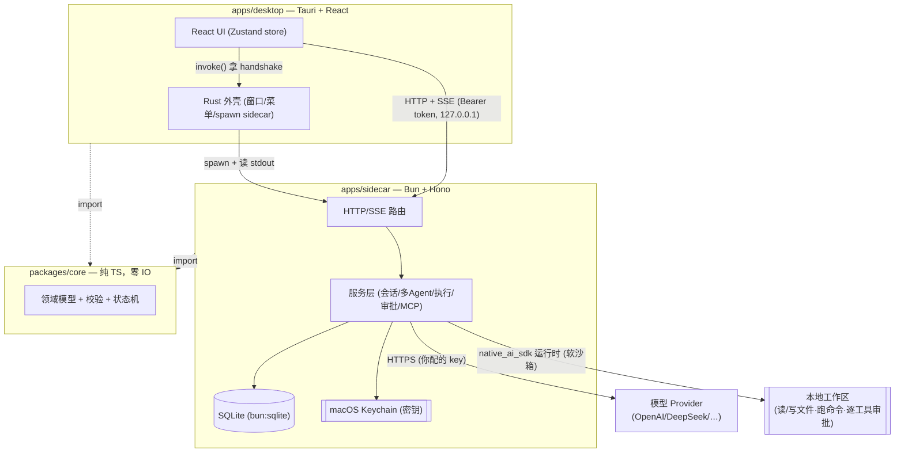
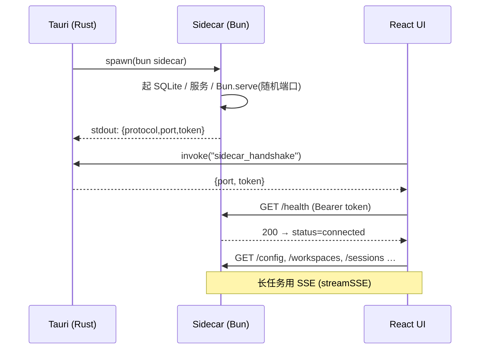
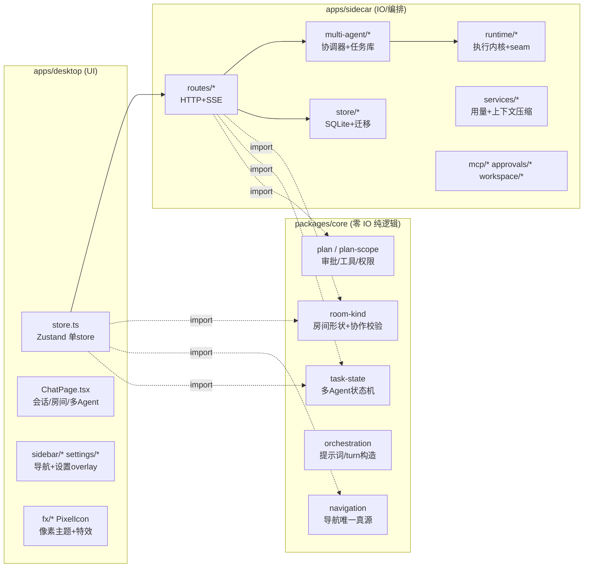
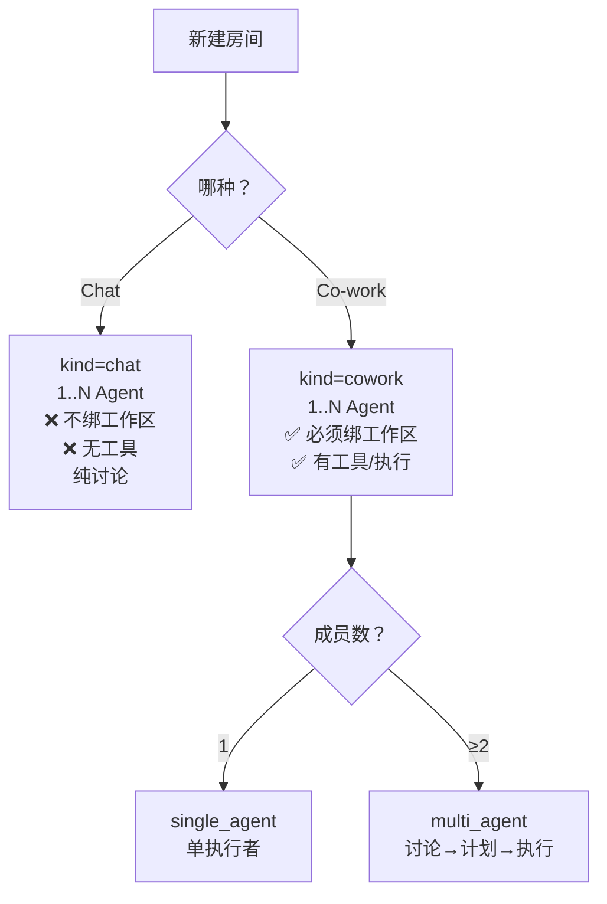
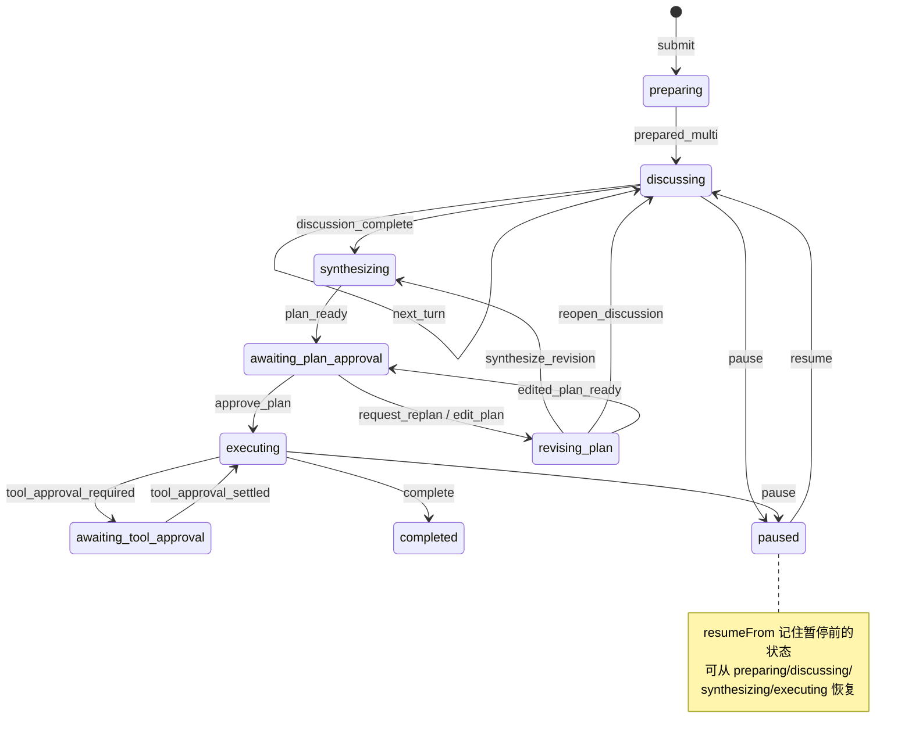
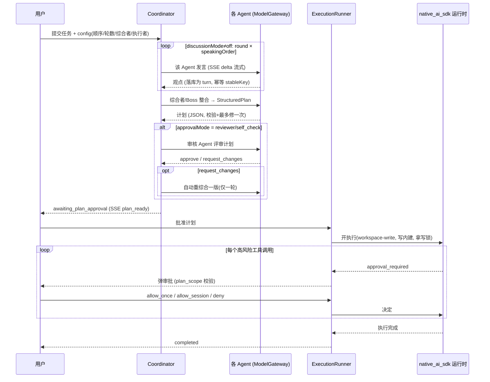
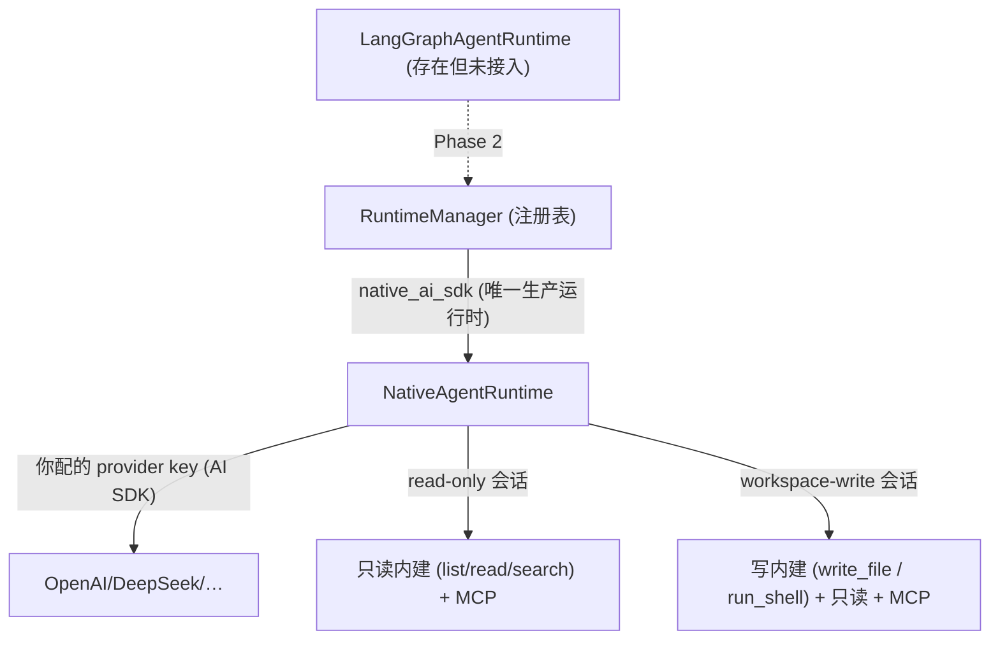

# Socrates 软件架构总览

> 事无巨细版：从进程拓扑、前端 UI 策略，到运行时骨架、房间/多 Agent 编排、执行内核与安全边界。
> 描述的是**当前代码库的真实实现**（不是规划稿）。截止 main 分支。

---

## 0. 一句话概括

Socrates 是一个**多模型群聊 + 本地协作**的桌面 Agent 工作台：
- **外壳**：Tauri（Rust）+ React 19 + Vite + Tailwind + Zustand。
- **大脑/IO**：一个 Bun 进程（sidecar），跑 Hono HTTP/SSE 服务，管所有状态、模型调用、执行。
- **执行内核**：Socrates 自研的 **`native_ai_sdk` 运行时**——用**你配的 provider key** 驱动模型循环调用工具（读/写文件、跑命令），逐工具审批。（Codex 依赖已在 #77 移除。）统一 `AgentRuntime` 接口做 seam，可再接 LangGraph/其它。
- **纯逻辑**：`packages/core` 是零 IO 的领域层，前后端共享同一份判断（房间形状、导航、状态机、审批规则）。

三层 monorepo（Bun workspaces）：



---

## 1. 进程拓扑与握手（怎么跑起来的）

### 1.1 启动链路

1. Tauri（Rust 外壳）作为**父进程**，`spawn` 一个 Bun 子进程运行 sidecar。
2. sidecar 随机分配端口、生成一次性 `token`（`crypto.randomUUID()`），把握手信息以**单行 JSON** 打到 stdout：
   ```json
   { "protocol": "socrates-sidecar/1", "port": 53211, "token": "…" }
   ```
   协议定义在 `packages/core/src/handshake.ts`，字段变更必须升版本号。
3. Rust 读到这行，解析后通过 Tauri command 暴露给前端。
4. React store 的 `connect()` 调 `invoke("sidecar_handshake")` 拿到 `{port, token}`，先打 `/health` 确认，再把 `status` 置为 `connected`。

### 1.2 之后所有通信

- 前端所有请求走 `sidecarFetch(hs, path)`：`http://127.0.0.1:<port>` + `Authorization: Bearer <token>`（`store.ts`）。
- sidecar 用 `Bun.serve({ idleTimeout: 0 })` —— **0 是故意的**，否则默认 10s 空闲超时会掐断推理模型的长流。
- 中间件双重闸门（`security/loopback.ts`）：只接受**回环 host** + **合法 renderer origin**，否则 403。
- **孤儿进程防护**：sidecar 每 2s 检查 `process.ppid === 1`（父进程没了会被 init 收养），一旦发现就优雅关停自己，避免占着端口。



---

## 2. 分层与依赖



**关键原则**：`core` 不碰任何 IO，前后端都 import 它。房间合不合法、导航目标合不合法、状态能不能转移——**同一份判断**，UI 不自己推断、后端兜底。

---

## 3. 前端（apps/desktop）

技术栈：**Tauri 2 + React 19 + Vite 7 + Tailwind 4 + Zustand 5**。像素风 UI + 8-bit 音效 + WAAPI 粒子特效。

### 3.1 状态管理与性能策略（P0 的核心）

单一 Zustand store（`store.ts`）持有所有状态。性能的关键是**订阅边界**（`selectors.ts`）：

- 组件只通过 `useStorePick(...keys)` = `useStore(useShallow(pick(...keys)))` 订阅**自己声明的字段**。
- `HIGH_FREQUENCY_KEYS`（`streaming`/`messages`/`agentEvents`/`currentMultiTask`/`usageSummaries`…）是每帧/每事件级更新的字段。受保护组件（设置、供应商、MCP、侧栏）的订阅清单被测试断言**与高频字段零交集**——所以流式 delta 不会重渲染这些无关组件。

流式渲染的三道减压：
1. **SSE + rAF 批处理**：`store.sendMultiTask` 把 delta 累积，用 `requestAnimationFrame` 批量 flush，不逐 token setState。
2. **节流 Markdown**（`useThrottledValue.ts`）：流式期间不对每帧全量重解析 Markdown，最终值仍落定。
3. **列表窗口化**（`listWindow.ts`）：长会话只渲染最近 N 条（`DEFAULT_WINDOW_SIZE=80`），更早的折叠可展开。选窗口而非虚拟化——因为变高的 Markdown/代码/审批卡会破坏滚动和无障碍。

### 3.2 导航模型（顶层只有 Chat / Co-work）

`AppMode = "chat" | "cowork"`，由 `NavigationTarget`（`core/navigation.ts`）单一真源派生：

```
NavigationTarget =
  | { kind: "chat_room";      roomId }
  | { kind: "cowork_room";    roomId, workspaceId }
  | { kind: "cowork_workspace"; workspaceId }
```

- `workspaceOfTarget()`：**Chat 永远返回 null** —— 这是"Chat 不得隐式继承工作区"的唯一执行点。
- 侧栏（`sidebar/sidebarLists.ts`）按模式过滤：Chat 是扁平房间列表，Co-work 是工作区树，两者互不串场。搜索范围随模式收窄，不改任何持久化关系。
- `ModeSegmented`（`sidebar/ModeSegmented.tsx`）是真正的 tablist（roving tabindex + 方向键），滑块用 transform 位移避免重排。
- **mode 是真实状态**：跟随导航到房间时切换，但删除/归档清空选中时不弹回 chat。
- **Settings 是 overlay，不是 NavigationTarget**（`settings/settingsOverlay.ts`）：关闭后必须回到原房间，所以不能占用 primary target。单实例，`⌘,` / 左下角按钮 / macOS 菜单都只聚焦同一个。

### 3.3 会话视图

`ChatPage.tsx` 按当前 target 渲染三种：
- **Chat 房间**：群聊气泡（`Bubble`/`StreamingBubble`），多成员用 `TaskComposer`。
- **Single Agent 会话**（cowork 单成员）：`SingleAgentSession`，带工具、审批。
- **Multi Agent 会话**（cowork 多成员）：`MultiAgentSession`，DISCUSSION SETUP 表单（发言顺序拖拽、轮数、综合者、执行者）+ 计划卡 + 审批卡 + 协作设置入口。

其它：Markdown 用 `MD_COMPONENTS`（`markdownLink.tsx`）安全链接——所有链接 preventDefault，http(s) 交系统浏览器，工作区相对路径不导航（防止 `[test.md](test.md)` 把 SPA 冲走）。i18n 三语（`i18n.ts`：zh-CN/zh-TW/en）。

---

## 4. 后端（apps/sidecar）

**Bun + Hono**，`index.ts` 是装配中心：建 DB、密钥库、各 Store/Manager/Runner，注册路由。

### 4.1 路由地图

| 路由 | 职责 |
| --- | --- |
| `/config` | 应用配置（主题/字号/代理/侧栏偏好） |
| `/providers` | 模型供应商 + 连接测试 + 列模型 |
| `/agents` | Agent（昵称/头像/模型/角色/系统提示） |
| `/rooms` | 群聊房间（Chat，legacy 表） |
| `/workspaces` | 工作区（本地目录）注册/归档 |
| `/sessions` | 会话（cowork 房间：single/multi agent）+ 协作设置 |
| `/agent` | 单 Agent 运行（SSE 流式） |
| `/multi` | 多 Agent 任务：讨论/计划/审批/执行（SSE 流式） |
| `/content` | 附件/工作区文件内容 |
| `/mcp` | MCP 服务器管理 + 工具 |

SSE 用 Hono 的 `streamSSE`，事件形如 `{ event: type, data: JSON }`（见 `routes/agent-runs.ts`、`routes/multi-agent.ts`）。

### 4.2 持久化：SQLite + 版本化迁移

`bun:sqlite`，迁移在 `store/migrations/`，**版本化 + 校验和 + 幂等**：

```
001 baseline               005 mcp
002 agent_workspace        006 multi_agent
003 runtime_foundation     007 usage_and_recovery
004 p2_conversations       008 project_conversation_organization
                           009 room_kind  ← Chat/Co-work 模型迁移
```

主要表：`providers` `agents` `workspaces` `sessions` `session_agents` `session_messages` `message_parts` `rooms` `multi_tasks` `multi_turns` `plan_versions` `runtime_sessions` `usage_records` `events` `mcp_servers` `approvals` `workspace_leases`。

**密钥永不进库**：`secrets.ts`（`KeychainSecrets`）存 macOS Keychain，库里只存 `api_key_ref` 引用。

---

## 5. 房间模型（Chat vs Co-work）

领域定义在 `core/room-kind.ts`。两种房间**唯一的结构差异是工作区**：



- `validateRoomShape()`：chat 不得绑工作区、cowork 必须绑、成员唯一、至少 1 人——前端先校验，`session-store` 兜底（绕过前端也建不出坏形状）。
- **不绑已归档工作区**：`session-store.create/bindWorkspace` 拒绝 `workspace_archived`。
- legacy：`rooms` 表（群聊）一律视为 chat；`sessions` 表按旧 `mode` 推导 `kind`（迁移 009）。
- **建房入口收敛**：前端 `createRoomFromDraft` 是唯一入口，工作区只来自草稿（不再从全局 `activeWorkspace` 隐式继承——那正是"Chat 看起来继承工作区"的历史根因）。

### 5.1 协作治理设置（Co-work Room Settings）

`RoomCollaborationSettings`（持久化在 `sessions.collaboration_json`）：

| 维度 | 值 | 运行时是否已接通 |
| --- | --- | --- |
| `discussionMode` | off / round_robin / (debate) | ✅ off/round_robin 已接 |
| `collaborationMode` | single_executor / agent_directed_multi_agent(Boss) / human_directed | ✅ Boss 已接 |
| `boss` | enabled / bossAgentId / allowBossExecution | ✅ 真实生效 |
| `approvalMode` | human / executor_self_check / designated_reviewer | ✅ 真实生效 |
| `supervisionMode` | off / final_only / … | ❌ 尚未接入运行时（UI 如实标注） |

跨字段规则集中在 `validateCollaborationSettings()`，前后端共用。

### 5.2 成员管理（#78）

Co-work 房间可增/删成员（`session-store` 的 `addAgent`/`removeAgent`，路由 `POST/DELETE /sessions/:id/agents`）：
- 仅**会话空闲**时可改（`active_session_members_locked`），**至少保留一人**。
- 加/减人后 **mode 按人数自动重算**：1 人 → `single_agent`，≥2 人 → `multi_agent`，`position` 重排——所以给单 Agent 会话加一个成员，它会自动变成多 Agent 会话。
- 前端 `SessionMembersDialog`，入口在单/多 Agent 会话头部的成员按钮。

**建房入口收敛**：从侧栏工作区分组的「＋」建房会**锁定为该工作区的 Co-work**（`presetWorkspaceId`），不再让重选工作区；「选工作区」只在全局「新建房间」时开放。

---

## 6. 多 Agent 编排（协调器）— 核心

`multi-agent/coordinator.ts` + `multi-agent/task-store.ts`。状态机定义在 `core/task-state.ts`（纯 reducer，可测）。

### 6.1 任务状态机



### 6.2 一次多 Agent 任务的完整流程



### 6.3 三个要点

**幂等与恢复**：每个 turn 用 `stableKey = task:attempt:phase:round:index` 落库。暂停/恢复时已完成的 turn 直接回放，不重复调模型。上下文用 `services/context-compaction.ts` 压缩。

**Boss（真实语义）**：`boss.enabled` 时由 Boss agent 整合出计划（替代配置的 synthesizer）；默认不执行，Boss 同时被指为执行者时判 `boss_must_not_execute`。

**Reviewer（真实语义）**：`executor_self_check`（执行者自审）/ `designated_reviewer`（指定人审）会**真跑一次审核 Agent**，产出 `approve`/`request_changes` 并 emit `reviewer_verdict`；request_changes 自动重综合一版（仅一轮，防死循环）后停在人工审批。审核 turn 复用同一套幂等机制（`phase=reviewing`）。

**讨论层用谁的 key**：讨论/综合/审核都走 `ModelGateway`，用你在 Socrates 里给每个 Agent 配的 provider key（`gateway({ apiKey: agent.apiKey, … })`）。

---

## 7. 运行时骨架与执行内核（seam 所在）

> **重要变更（PR #77）**：Codex 已被**整个移除**（`runtime/codex/`、`child-supervisor` 全删）。
> 执行内核现在是 Socrates 自研的 **`native_ai_sdk` 运行时**，用**你在 Socrates 里配的 provider key**
> 跑，不再依赖本机 codex 登录/额度。roadmap 里的 Phase 1（摆脱 Codex）基本达成。

### 7.1 统一接口 + 注册表

`runtime/runtime-manager.ts` 是运行时注册表：`register(kind, factory)`，按字符串 `runtimeKind` 取工厂。所有运行时都实现 `core` 的 `AgentRuntime` 接口。**生产只注册了一个**：`native_ai_sdk`。（另有一个 `LangGraphAgentRuntime` 已在代码里，但**尚未 register 进生产**，见 roadmap Phase 2。）



`native_ai_sdk` 按 sandbox 决定可用能力（`index.ts` 计算 `writeCapabilities` 传入运行时）：

| sandbox | 鉴权/计费 | 可用工具 |
| --- | --- | --- |
| `read-only` | **你配的 API key** | 只读内建（list/read/search）+ MCP |
| `workspace-write` | **你配的 API key** | 上面 + 写内建 `write_file` / `run_shell`（risk high/destructive，须审批） |

> **计费**：整条链路（讨论 + 执行）都走 `ModelGateway` / `native_ai_sdk`，用的是**你配的 provider key**。不再有"codex 登录额度"这回事。
>
> **写能力接线（易错点，见 #78）**：`NativeAgentRuntime.start()` 曾硬编码 `allowedCapabilities: ["workspace_read","mcp"]`，把写工具过滤掉——导致 workspace-write 却只有只读。现在由 `index.ts` 按 sandbox 传入 `allowedCapabilities`（含 `workspace_write`），写工具才到得了模型。缺省仍退回只读，绝不擅自开放写。

### 7.2 执行内核（ExecutionRunner）

`runtime/execution-runner.ts`：多 Agent 任务拿到**已批准**的计划后——
1. 校验计划哈希与状态（`approved_plan_required`）。
2. 解析工作区、检查 evidence 时效、**获取写锁**（`workspace/leases.ts`，30 分钟租约，定时续租，丢锁自动取消）。
3. 开 **`native_ai_sdk`** 运行时（sandbox=workspace-write，带写内建），流式跑计划。
4. **每个高风险工具调用**：走 `ApprovalManager` 请求审批；`plan-scope.ts` 判断是否在计划范围内（超范围 = `plan_scope_expansion`，强制人工）。
5. 完成 → `complete`；失败 → `fail(reason)`（reason 存 `terminalReason`，前端会展示）。

### 7.3 下一步（roadmap）

seam 已就绪且已被用上（execution-runner 现在指向 `native_ai_sdk`）。后续按 [native-runtime-and-langgraph-roadmap.md](native-runtime-and-langgraph-roadmap.md)：把 `LangGraphAgentRuntime` register 进生产做治理编排（Phase 2），以及可选的 Rust 执行辅助进程强化沙箱/资源限制（Phase 6）。当前的沙箱是**软沙箱**（工作区路径策略 `path-policy.ts` + 写锁 + 逐工具审批），跨平台但非内核级隔离。

---

## 8. 安全边界

| 层 | 机制 |
| --- | --- |
| 传输 | 仅回环 `127.0.0.1` + 一次性 Bearer token + origin 校验（否则 403） |
| 密钥 | macOS Keychain，库里只存引用；日志里 `sk-…` 主动打码（`security/redaction.ts`） |
| 执行沙箱 | 软沙箱：工作区路径策略（`path-policy.ts`，禁越界/symlink 逃逸）+ read-only/workspace-write 能力分级 + 写锁 |
| 逐步审批 | 计划审批（人/审核 Agent）+ 每个高风险工具调用审批（`ApprovalManager`），计划范围外强制人工 |
| 工作区隔离 | 写锁租约（`leases.ts`）+ 路径策略（`path-policy.ts`，禁止越界访问） |
| 子进程 | 环境变量白名单，父进程死亡自动退出 |

---

## 9. 各"任务"是怎么落地的（速查）

| 需求 | 实现位置 | 方案要点 |
| --- | --- | --- |
| 多模型群聊 | `rooms.ts` + `ModelGateway` | 每个 Agent 独立 provider/key，SSE 流式 |
| 多 Agent 讨论 | `multi-agent/coordinator.ts` | round-robin × maxRounds，可 `discussionMode=off` 跳过 |
| 计划生成 | 协调器 `synthesize()` | 综合者/Boss 产出 `StructuredPlan`（JSON，校验+修复） |
| Boss 统筹 | 协调器 `effectiveSynthesizerId` | Boss 接管综合，默认不执行 |
| Agent 审核 | 协调器 `reviewPlan()` | 真跑审核 Agent，request_changes 自动改一版 |
| 本地执行 | `execution-runner.ts` + `native_ai_sdk` | 你配的 key + 写内建 + 写锁 + 逐工具审批 |
| 单 Agent 带工具 | `native-agent-runtime.ts` | AI SDK + 只读内建 + MCP 工具 |
| 用量统计 | `services/usage-collector.ts` | 按 stableKey 幂等记账，前端 usageSummaries |
| MCP 工具 | `mcp/manager.ts` `mcp/adapter.ts` | 官方 MCP client，工具注入 native runtime |
| 附件/工作区文件 | `attachments/` `content` 路由 | 快照哈希，消息 parts 引用 |
| 性能（流式不卡） | `selectors.ts` `useThrottledValue` `listWindow` | 订阅边界 + rAF 批处理 + 窗口化 |

---

## 10. 已知未接通 / 后续

- **多执行者分派**（Boss 把 work package 分给不同 Agent 分别执行）：运行时只有单 `executionAgentId`，未实现。
- **Supervision 监督**：类型/UI 有，协调器未消费。
- ✅ **执行层计费已解耦**（#77）：执行改走 `native_ai_sdk` + 你配的 provider key，不再依赖 codex 登录。
- **LangGraph 编排**：`LangGraphAgentRuntime` 已在代码里但未 register 进生产（roadmap Phase 2）。
- **`discussionMode=debate`**：未实现（只有 off/round_robin 生效）。

---

## 附：关键文件索引

- 领域：`packages/core/src/{room-kind,navigation,task-state,orchestration,plan,plan-scope,approvals}.ts`
- 后端装配：`apps/sidecar/src/index.ts`
- 多 Agent：`apps/sidecar/src/multi-agent/{coordinator,task-store}.ts`
- 执行内核 + seam：`apps/sidecar/src/runtime/{runtime-manager,execution-runner,native-agent-runtime,langgraph-agent-runtime}.ts` + `tools/{read-only-builtins,workspace-write-builtins}.ts`
- 前端主视图：`apps/desktop/src/ChatPage.tsx`、`store.ts`、`selectors.ts`
- 导航/侧栏：`apps/desktop/src/sidebar/`、`settings/`
