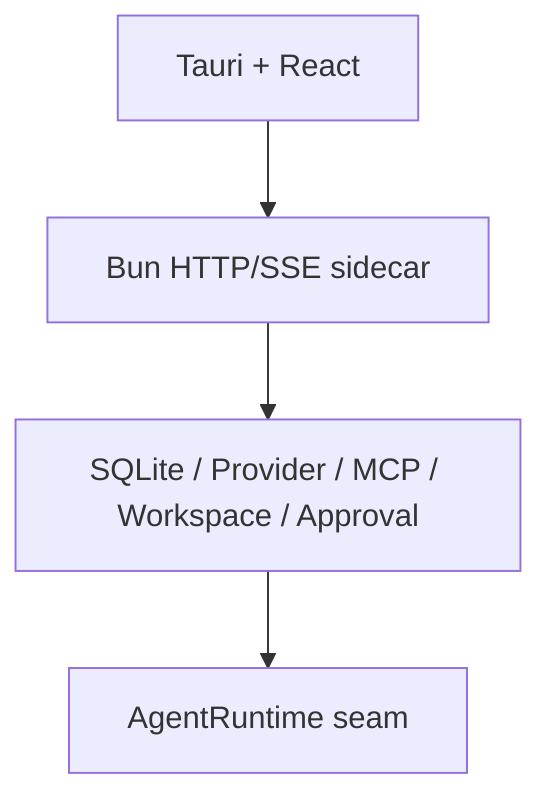
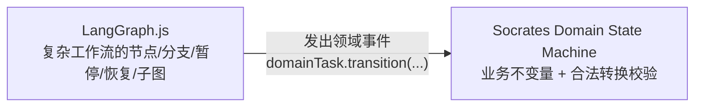

# Socrates 执行内核与编排层演进路线（决策记录）

> 这是一份**战略方向 / ADR**：Socrates 当前真正卡住的不是 Tauri、React、Bun 或自研状态机，
> 而是 **①执行内核依赖 Codex 登录** 和 **②多 Agent 编排继续堆在一个手写 Coordinator 里**。
> 结论：**不重写产品**，沿现有 seam 做两件事——实现 Socrates Native Runtime、用 LangGraph.js 重构治理编排。
>
> 关联文档：[architecture.md](architecture.md)（当前真实架构）。

---

## 📌 进度更新（截至 #78）

- ✅ **Phase 1 基本达成**：#77 移除了整个 Codex 依赖，执行改走自研 `native_ai_sdk` 运行时 +
  workspace-write 内建工具（`write_file`/`run_shell`），用**你配的 provider key**，不再依赖 codex 登录/额度。
  `execution-runner` 的 `runtimeKind` 现在是 `native_ai_sdk`。
- 🚧 **Phase 2 起步**：`LangGraphAgentRuntime` 已在代码里（`runtime/langgraph-agent-runtime.ts`），
  但**尚未 register 进生产**，也还没接治理编排（多 Agent 仍由手写 `MultiAgentCoordinator` 驱动）。
- ⏳ 待办：多执行者分派、supervision 运行时、LangGraph 治理图、Rust 执行辅助进程（Phase 3–6）。
- ⚠️ §13 的安全点（`parseVerdict()` 无法解析时默认 approve）**尚未修**，将来 Reviewer 代替人工审批前必须处理。

下面是原始决策记录，方向不变。

---

## 最重要的结论（先看这个）

现在**不应该重写 Socrates**，而应沿现有 seam 做两件事：

1. **实现 Socrates Native Runtime** —— 摆脱 Codex 登录和额度依赖。
2. **用 LangGraph.js 重构 Governed / Manager–Worker 编排** —— 但**保留** Socrates 的状态、工具、安全和数据库权威。

现有资产不应推倒：项目已有相当完整的 Provider、Session、SQLite、Event Store、Workspace、审批、MCP 和 Runtime seam。整个仓库约 96.8% 是 TypeScript。截图里那套 Rust TUI + Python Agent 是"从零开发另一个产品"的方案，不适合替换当前桌面 GUI 产品。

---

## 决策清单

### ✅ 应该做
- 保留 **Tauri + React/TS**。
- 保留 **Bun sidecar** 作为应用服务和业务状态权威。
- 引入 **LangGraph.js**，负责复杂多 Agent 工作流。
- 保留当前自研领域状态机（`task-state.ts`），作为**业务合法性检查**。
- 实现新的 **Socrates Native Execution Runtime**，替换 Codex 执行依赖。
- Rust 只负责真正需要系统能力的部分：进程启动、命令终止、路径/环境隔离、Git worktree、可选沙箱。
- Manager–Worker **先做确定性版本**，再逐步增加智能分配。

### ⛔ 目前不要做
- 不要把核心改成 Python sidecar。
- 不要把整个项目迁移到 Rust TUI。
- 不要用 PyO3 把 Python 嵌入 Rust。
- 不要引入 Redis。
- 不要先实现 seccomp / namespace / cgroup 全家桶。
- 不要让 LangGraph 直接写文件和执行 Shell。
- 不要删除当前 `task-state.ts`。
- 不要一开始就让多个 Worker 任意并行修改同一个仓库。

---

## 一、截图里的架构是否更合适？—— 不适合直接替换

截图方案适合从零做一个 `Rust TUI Coding Agent + Python Agent Engine + Linux-first Sandbox`。
但 Socrates 已经是桌面 GUI 产品：



改成截图架构 = 同时更换 UI、应用运行时、编排语言、IPC、打包、依赖管理、测试体系、状态持久化边界。**这不是"优化 Runtime"，而是重写产品。**

正确做法是把截图里的**思想**拆出来借用：
- LangGraph：可以借
- Manager–Worker：可以借
- Rust 执行辅助进程：可以借
- Git worktree：可以借
- Python 作为核心：暂时不要
- TUI：以后作为第二客户端，不替换桌面端

---

## 二、LangGraph 是什么？—— 编排 Runtime，不是执行 Runtime

官方定义：低层 agent orchestration framework / runtime，重点是 durable execution、persistence、interrupt、resume、streaming、human-in-the-loop、subgraph、长时有状态工作流。

适合控制这种流程：
```
分析任务 → 拆分任务 → 等待用户确认 → 分配 Worker → 执行 → Reviewer → Supervisor → 返工/重规划 → 完成
```

但 LangGraph **不会**自动提供：安全文件写入、Workspace 路径隔离、Shell 沙箱、Git worktree、命令资源限制、API Key 管理、文件锁、高风险审批策略、跨 Provider usage 归一化。

> 定位：**Agent Workflow Runtime / 编排 Runtime**，而**不是** OS 执行 Runtime / Coding Sandbox。

---

## 三、当前自研状态机"不稳定"吗？—— 并不是

`task-state.ts` 是纯函数 reducer：明确状态、明确事件、非法转换抛 `InvalidTaskTransitionError`、终态不可再转、pause/resume 保存恢复点。

它的问题不是不稳定，而是：状态数量还不够、复杂分支增加后手写转换表难维护、没有 checkpoint/interrupt/subgraph/工作流级恢复、当前 Coordinator 承担了过多工作。

**不要二选一**，正确方式是**双层**：



例：LangGraph 从 Reviewer 节点得到 `request_changes`，**不能**直接把库写成 `reworking`，而是发出领域事件：
```ts
domainTask.transition({ type: "review_changes_requested", reviewId });
```
由 Socrates reducer 判断该事件是否合法。这样即使 LangGraph 出 Bug，也越不过业务规则。

---

## 四、Python LangGraph 还是 LangGraph.js？—— 先用 LangGraph.js

JS 版已支持 Graph API、persistence、SQLite checkpointer、interrupts、streaming、subgraphs、durable execution。sidecar 本就是 TS/Bun，架构可保持：

```
React → Bun Sidecar { Socrates Services, LangGraph.js, Provider Gateway, Tool Broker, SQLite }
```

不需要引入 Python 安装 / venv / pip-uv / native wheels / 版本冲突 / Bun↔Python IPC / Python 子进程恢复 / 额外 runtime 的签名打包。

**但正式接入前先做 Bun PoC**，验证：graph invoke/stream、interrupt/resume、SQLite checkpointer、subgraph、abort、应用重启恢复。不要默认它能直接共享 `bun:sqlite` 数据层——官方有独立 SQLite checkpointer，需决定：用其 checkpointer / 为现有 SQLite+Event Store 写 adapter / 初期用内存 checkpointer 验证。

**何时才需要 Python LangGraph**：出现明确需求时（大量 Python-only AI/RAG 库、本地 ML 推理、Python 数据分析工具、特定 Python Agent 插件、或 LangGraph.js 缺关键能力）。那时增加一个 **Python Tool Host**，而不是让 Python 成为整个应用的状态权威。

---

## 五、LangGraph 放在哪一层？

```
Tauri + React
   │ HTTP / SSE
   ▼
Bun Sidecar — Socrates Application Runtime
├── Room / Session Store
├── Provider Registry
├── Agent Registry
├── Workspace Manager
├── Tool Registry
├── Permission / Approval
├── Event Store
├── Usage Collector
│
├── Orchestration Layer
│   ├── Direct Runner ── Chat / Quick
│   └── LangGraph.js Runner
│       ├── Balanced Graph
│       └── Governed Graph
│           ├── Manager
│           ├── Decomposer
│           ├── Assignment
│           ├── Worker Subgraphs
│           ├── Reviewer
│           ├── Supervisor
│           └── Integration
│
└── Execution Backend
    ├── Socrates Native Runtime
    ├── Optional OpenAI Agents SDK Adapter
    └── Legacy Codex Adapter
             │
             ▼
       Rust Execution Helper
       ├── spawn / kill
       ├── cwd / env policy
       ├── Git worktree
       ├── resource limits
       └── optional sandbox
```

---

## 六、最先解决：Codex 执行依赖

`RuntimeManager` 已是注册表（可注册不同 `runtimeKind`），设计很好。真正的问题在 `ExecutionRunner`：`runtimeKind: "codex_app_server"` **被硬编码在执行路径里**，所以 workspace-write 最终必须依赖本机 Codex 登录。

最小改造不是重写应用，而是实现 `socrates_native` 并把执行后端改成**策略解析**：

```ts
runtimeManager.register("socrates_native", (input) => new SocratesNativeRuntime(...));

// 执行后端从固定值改为按能力/供应商/沙箱解析
const runtimeKind = executionBackendResolver.resolve({ provider, model, sandbox, capabilities });
// 而不是固定 "codex_app_server"
```

这样用户用自己在 Socrates 里配的 OpenAI / Anthropic / DeepSeek / OpenAI-compatible key 就能执行，不再需要 Codex 登录。

---

## 七、Socrates Native Runtime 该做什么？—— 两部分

### 1. 模型 Agent Loop（两条路线）

**路线 A：扩展当前 Native Runtime（推荐第一版）**
已有 ModelGateway、Provider、Tool Registry、MCP、只读工具。最小改造是加写工具：
`propose_patch` / `apply_patch` / `write_file` / `move_file` / `delete_file` / `execute_command` / `command_status` / `cancel_command`。
所有工具继续走：`ToolOperation → PermissionManager → ApprovalManager → ToolExecutor`。

**路线 B：OpenAI Agents SDK 作为 Agent Loop**
支持内置 agent loop、function tools、human-in-the-loop、agents-as-tools、custom ModelProvider、Vercel AI SDK 模型适配：
```
OpenAI Agents SDK → custom ModelProvider / AI SDK adapter → Socrates Tool Broker
```
不要求所有 Agent 都用 OpenAI 模型。但它只负责"模型怎样循环调用工具"，**安全审批仍由 Socrates 控制**。

> **推荐第一版**：LangGraph.js 管多 Agent 编排 + 当前/简化 Native Runner 管单 Agent loop + Socrates Tool Broker 管所有副作用。**不要一次性同时引入 LangGraph 和 OpenAI Agents SDK 两个大改造。**

---

## 八、Manager–Worker：对的，但不要只让 LLM 打分

Manager 思路合理（拆分 → 判难度 → 按价格和能力分配），但 **LLM 的难度分不能是唯一事实来源**。

Work Package 至少应包含：
```ts
type WorkPackage = {
  id: string;
  title: string;
  objective: string;
  dependencies: string[];
  expectedFiles: string[];
  requiredCapabilities: string[];
  difficulty: "low" | "medium" | "high";
  risk: "low" | "medium" | "high";
  estimatedContextSize: number | null;
  canRunInParallel: boolean;
  executorAgentId: string | null;
  reviewerAgentId: string | null;
  supervisorAgentId: string | null;
  acceptanceCriteria: string[];
};
```

分配用**混合策略**：`确定性规则 + Manager 建议 + 用户覆盖`。确定性规则考虑：是否改数据库/依赖/跨模块/涉及安全/危险命令、预计文件数、是否需视觉判断、Agent 能力（图片/工具/上下文）、模型价格档、历史成功率。

例：简单文档和测试 → 低成本模型；跨模块 Runtime → 强推理模型；安全 Reviewer → 可靠保守模型；最终集成 → Boss 或高能力模型。

---

## 九、通信机制怎么选

| 链路 | 结论 |
| --- | --- |
| UI ↔ Bun | 继续 **HTTP + SSE**，已工作，不改 |
| Bun 内部 | 普通函数调用 + async queue + Event Store，**不需要 Redis** |
| Bun ↔ Rust Execution Helper | MVP 用 **stdio 上的 length-prefixed JSON-RPC**（`{protocolVersion, requestId, method, params}`，支持 response/event/cancellation/heartbeat/process-exit/stderr）；性能需要时再换 Unix domain socket / named pipe，**不需要先上 gRPC** |
| Python（未来） | 同样协议，把 Python 当**可替换 Worker**，不共享内存 |

**不推荐**：`Arc<Mutex>`（只适合 Rust 进程内）、Redis（本地桌面 MVP 没必要）、PyO3（耦合太深、崩溃传染、打包复杂）、CRDT（改源码不是实时多人文本编辑）。

---

## 十、Git 分支隔离 → Git worktree 隔离

"每个 Worker 一个 branch"不够——多个 branch 共用同一工作目录仍不能同时工作。应是：**每个 Worker = 一个 branch + 一个独立 git worktree**。

```
repo/
worktrees/
├── task-a/   (branch task/a)
├── task-b/   (branch task/b)
└── integration/
```

**但不要一开始就全任务并行。**

- **第一版**：Single Writer per File + Operation Queue + Patch。只读任务可并行；写任务默认顺序执行；写集合不重叠时才并行。
- **第二版**：Worker Worktree + Worker Commit + Integration Service。Manager **不应**自己用自然语言"合并代码"，应由确定性 **Integration Service** 做：cherry-pick / merge / 冲突检测 / 跑测试 / 生成 diff / 交 Reviewer 或用户处理冲突。
- **CRDT 不需要**（Yjs 适合多人实时编辑，不适合 Agent 独立改代码树）。

---

## 十一、Rust 沙箱：seccomp/namespace/cgroup 是 Linux-only

seccomp-bpf、namespace、cgroup、chroot 都是 Linux 内核机制。主要开发平台是 macOS，**不能**把它们作为跨平台 MVP 基础（Docker Desktop 在 macOS 上是通过 Linux VM 跑容器，不是直接用 macOS 内核隔离）。

推荐分层 `SandboxBackend`：
```ts
interface SandboxBackend {
  createSession(...): Promise<SandboxSession>;
  execute(...): AsyncIterable<ProcessEvent>;
  cancel(...): Promise<void>;
  dispose(...): Promise<void>;
}
```

- **SoftSandbox（默认，跨平台）**：workspace cwd、路径白名单、symlink 防越界、环境变量白名单、命令审批、超时、输出限制、进程树终止、网络策略、凭证路径禁止、文件操作审计。
- **DockerSandbox（可选）**：用户装了 Docker 时启用，隔离更强但启动慢、依赖 Docker Desktop、挂载权限复杂。
- **LinuxHardSandbox（后续）**：Linux 上再加 Landlock / seccomp / namespaces / cgroup。（Landlock 官方也指出 namespace 本身不是细粒度访问控制，不能只靠它认为安全。）

---

## 十二、LangGraph 的 State 存什么？—— 只存 ID 和控制状态

不要把所有消息、diff、文件内容塞进 Graph State。

```ts
type GovernedGraphState = {
  taskRunId: string;
  graphVersion: string;
  currentWorkPackageId: string | null;
  pendingWorkPackageIds: string[];
  completedWorkPackageIds: string[];
  pendingApprovalId: string | null;
  pendingValidationId: string | null;
  reworkCountByPackage: Record<string, number>;
  terminalReason: string | null;
};
```

真实数据仍在 Socrates SQLite（WorkPackage / ToolOperation / ApprovalDecision / StageValidation / Message / Usage / Event）。LangGraph checkpoint 只负责：当前节点、图执行游标、pending interrupt、子图状态。

> interrupt 会持久化图状态并在恢复时继续；节点可能重新执行，**故中断前的副作用必须幂等**——这与现有的 stable key / operation ID / event store / idempotent usage 高度匹配。

---

## 十三、⚠️ 一个必须尽快改的安全点

当前 `MultiAgentCoordinator` 的 `parseVerdict()`，在 **Reviewer 输出无法解析时默认 `approve`**。现在因为后面还有人工计划批准，风险受限；但**将来 Reviewer 代替用户处理操作审批时，绝不能默认批准**。

应改为：
```
invalid reviewer output → escalate_to_human   // 或 → request_changes
```
**绝不能默认批准。**

---

## 十四、开发路线（Phase 0–6）

| Phase | 目标 | 内容 |
| --- | --- | --- |
| **0 停止架构漂移** | 冻结决定 | 保留 Tauri+React+Bun；采用 LangGraph.js；暂不加 Python；先替换 Codex 执行依赖 |
| **1 Native Execution Runtime** | 单 Agent 不靠 Codex 也能改代码 | 实现 `socrates_native`，最小工具：read / search / propose patch / apply patch / execute command / cancel command；接入现有 Workspace/Permission/Approval/Event Store/Usage |
| **2 LangGraph.js PoC** | 验证编排可行 | 不迁移整个 Coordinator。只做 Analyze → Decompose → Assignment interrupt → Worker A → Reviewer → Supervisor → Complete/Rework；两个虚拟 WorkPackage + 无副作用 fake tool + SQLite/内存 checkpoint + restart/resume/cancel/duplicate event/graph version。通过后再接真实 Tool Broker |
| **3 Manager–Worker v1** | 确定性治理 | 固定 Room members；Manager 拆任务；混合难度评分；用户确认 Assignment Board；单 Worker 顺序执行；Reviewer；final Supervisor；**不并行写文件** |
| **4 Worktree Workers** | 并行隔离 | 每 Worker 一个 worktree + 独立 branch + commit；Integration worktree；冲突检测；测试；用户确认合并 |
| **5 真正 Governed** | 完整治理 | 多 Worker；关键阶段 Supervisor；重新分配；预算上限；模型 fallback；Graph versioning；完整崩溃恢复 |
| **6 Rust Execution Helper** | 系统能力强化 | 进程组；资源限制；可选 Docker；平台特定 SandboxBackend |

---

## 最终技术选型表

| 项目 | 结论 |
| --- | --- |
| Tauri + React | 保留 |
| Bun sidecar | 保留，继续做应用状态权威 |
| 当前状态机（`task-state.ts`） | 保留为领域状态机 |
| LangGraph.js | 引入，负责复杂编排 |
| Python LangGraph | 暂不引入 |
| Python sidecar | 未来作为可选 Tool Host |
| PyO3 | 不建议 |
| OpenAI Agents SDK | 可选的单 Agent loop adapter |
| Codex app-server | 逐步降级为兼容后端 |
| Socrates Native Runtime | **最高优先级** |
| Rust TUI | 未来独立客户端，不替换 GUI |
| Redis | 不需要 |
| Git branch only | 不够 |
| Git worktree | 多 Worker 第二阶段采用 |
| 操作队列 | MVP 优先采用 |
| CRDT | 不需要 |
| Docker | 可选高级沙箱 |
| seccomp / cgroup / namespaces | 仅 Linux 后续能力 |

---

## 对照当前代码的落点（便于开工）

- **Codex 硬编码**：`apps/sidecar/src/runtime/execution-runner.ts`（`runtimeKind: "codex_app_server"`）→ 改为策略解析。
- **Runtime 注册表**：`apps/sidecar/src/runtime/runtime-manager.ts`（`register(kind, factory)`，seam 已就绪）。
- **领域状态机**：`packages/core/src/task-state.ts`（保留，作为合法性闸门）。
- **Native Runtime 起点**：`apps/sidecar/src/runtime/native-agent-runtime.ts`（路线 A 在此加写工具）。
- **审批链**：`apps/sidecar/src/approvals/manager.ts` + `packages/core/src/{permissions,plan-scope}.ts`。
- **待修安全点**：`apps/sidecar/src/multi-agent/coordinator.ts` 的 `parseVerdict()` 默认 approve（§13）。
