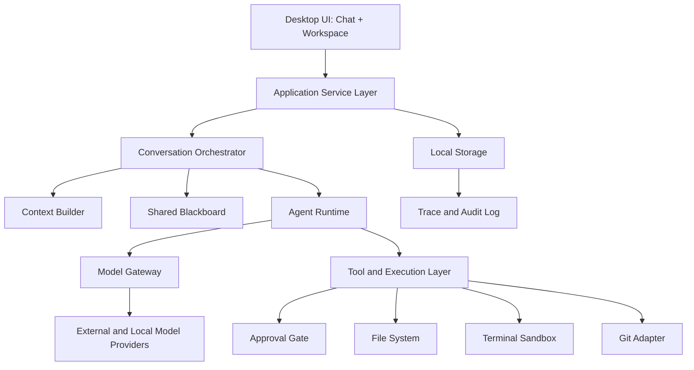
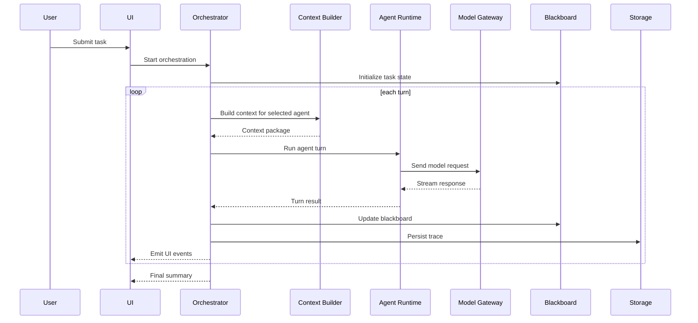
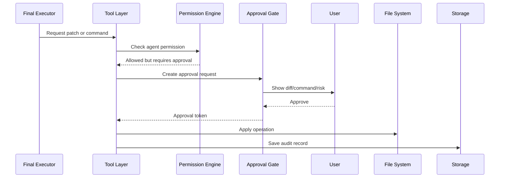

# Socrates 系统架构设计

## 1. 架构目标

Socrates 的架构目标是支持多模型、多角色、多轮讨论，并将讨论结果安全地转化为总结、计划、patch 或命令执行。

核心要求：

- Provider 可扩展：新增模型供应商不影响编排逻辑。
- Agent 可配置：模型、角色、权限、提示词和预算彼此解耦。
- Orchestration 可插拔：不同讨论模式可作为策略实现。
- Execution 可控：所有写操作和命令执行都经过权限和审批。
- Context 可追溯：每轮模型看到什么、输出什么、影响什么都可审计。
- Local-first：默认本地存储和本地执行。

## 2. 总体架构



## 3. 推荐技术栈

### 3.1 桌面端

建议使用 Tauri + React + TypeScript。

原因：

- Tauri 比 Electron 更轻。
- TypeScript 适合快速构建复杂前端状态和 provider adapter。
- React 生态适合构建聊天流、控制面板和 diff viewer。
- Tauri 的 Rust 侧适合做安全边界、文件系统权限和系统 API。

### 3.2 后端编排层

MVP 建议直接使用 TypeScript 实现 orchestration 和 provider adapter。

后续如果需要强化 sandbox 和系统能力，可以将敏感操作下沉到 Rust sidecar 或 Tauri command。

### 3.3 数据存储

建议使用 SQLite 作为本地数据库。

理由：

- 本地优先。
- 易备份。
- 适合保存 Room、Agent、消息、trace、审批记录。
- 后续可迁移到 libSQL 或云同步。

### 3.4 向量索引

MVP 不需要向量数据库。

V1/V2 可选择 LanceDB、Chroma、SQLite vector extension 或本地 embedding index。

## 4. 分层设计

### 4.1 UI Layer

负责群聊式交互和工作台展示。

主要模块：

- Room List：项目和房间列表。
- Chat Timeline：用户、Agent、工具调用、总结消息。
- Control Panel：模型成员、发言顺序、轮数、模式、预算、权限。
- Blackboard Panel：任务目标、发现、风险、决策、行动计划。
- Context Panel：本轮上下文来源、文件列表、token 估算。
- Execution Panel：diff、命令、审批、运行结果。
- Settings：供应商、模型、Agent 模板、全局安全策略。

UI 需要避免传统 IDE 的压迫感，整体应更像 WeChat 群聊加项目侧栏。

### 4.2 Application Service Layer

连接 UI、数据库和核心运行时。

职责：

- Room CRUD。
- Agent CRUD。
- Provider CRUD。
- Task lifecycle 管理。
- 用户操作转换为 domain command。
- 将 runtime event 转换为 UI event。
- 管理暂停、继续、取消任务。

### 4.3 Conversation Orchestrator

核心编排模块。

职责：

- 根据 policy 决定下一位发言 Agent。
- 构造每一轮 turn。
- 调用 Context Builder。
- 调用 Agent Runtime。
- 更新 Shared Blackboard。
- 判断是否达到停止条件。
- 触发最终总结或执行阶段。
- 记录 trace。

Orchestrator 不直接知道具体模型 API，也不直接写文件或运行命令。

### 4.4 Agent Runtime

负责执行单个 Agent 的一次发言。

职责：

- 合并 Agent system prompt、Room rules、Task context 和 previous turns。
- 调用 Model Gateway。
- 处理 streaming。
- 解析结构化输出。
- 识别工具调用请求。
- 根据权限请求 Tool Layer。

### 4.5 Model Gateway

统一模型调用接口。

职责：

- 抹平供应商 API 差异。
- 支持 OpenAI-compatible、Anthropic、Gemini、本地模型等 adapter。
- 统一 message schema。
- 统一 streaming event。
- 统一错误类型。
- 统一 token usage。
- 统一工具调用格式。

Provider adapter 必须只负责通信和格式转换，不应包含产品逻辑。

### 4.6 Context Builder

负责构建模型输入上下文。

职责：

- 从对话历史中选择相关消息。
- 从 Shared Blackboard 中提取结构化状态。
- 从项目文件中读取相关片段。
- 对长上下文做裁剪、摘要或检索。
- 计算 token 估算。
- 给 UI 返回上下文来源说明。

MVP 可以先只使用完整短历史加用户手动选择文件。

### 4.7 Shared Blackboard

共享黑板是多模型讨论的结构化中间层。

它不替代聊天记录，而是把聊天中的重要信息沉淀为可被后续 Agent 使用的状态。

黑板应支持：

- 自动从模型输出中抽取字段。
- 用户手动编辑。
- 每轮变更 diff。
- 版本历史。
- 最终决策锁定。

### 4.8 Tool and Execution Layer

工具层负责所有外部副作用。

工具类型：

- Read-only：读取文件、搜索文件、读取 git status。
- Write：写文件、应用 patch、格式化文件。
- Command：运行测试、执行脚本、安装依赖。
- Network：浏览器搜索、网页抓取、远程 API。
- Git：diff、commit、branch、push。

工具层必须接入 Approval Gate 和 Permission Engine。

### 4.9 Storage Layer

本地存储包括：

- Provider 配置。
- Agent 配置。
- Room 配置。
- Conversation messages。
- Turn trace。
- Blackboard snapshots。
- Tool calls。
- Approval records。
- Cost usage。

API Key 不应明文放在普通 SQLite 表中，应使用系统 keychain 或加密存储。

## 5. 核心数据流

### 5.1 普通讨论流程



### 5.2 执行流程



## 6. 编排边界

Orchestrator 应只做任务流控制，不承担以下职责：

- 不直接调用具体供应商 API。
- 不直接写文件。
- 不直接决定安全权限。
- 不直接拼接 UI 文案。
- 不保存 API Key。

这样可以保证核心编排逻辑可测试、可替换、可复用。

## 7. 部署形态

### 7.1 MVP

单机桌面应用。

所有 Room、消息和配置保存在本地。

### 7.2 V1

本地桌面应用加可选本地 worker。

Python worker 可用于 Notebook、科学计算、PDF、文档解析。

### 7.3 V2

可选云同步。

云端只同步用户选择同步的 Room、Agent 模板和非敏感配置。API Key 默认不同步。

## 8. 推荐未来目录结构

以下只是未来实现建议，不代表当前已经开始写代码。

```text
socrates/
  apps/
    desktop/
      src/
        ui/
        routes/
        state/
        tauri/
  packages/
    core/
      orchestrator/
      agent-runtime/
      context/
      blackboard/
      policy/
    model-gateway/
      providers/
      schema/
    tools/
      fs/
      git/
      terminal/
      approval/
    storage/
      sqlite/
      migrations/
    shared/
      types/
      events/
      errors/
  docs/
```

## 9. 架构原则

- 讨论和执行分离。
- 模型和 Agent 分离。
- Provider adapter 和业务逻辑分离。
- 工具调用和权限判断分离。
- 聊天记录和黑板状态分离。
- 默认只读，显式授权写入。
- 优先可解释和可审计，而不是盲目自动化。
